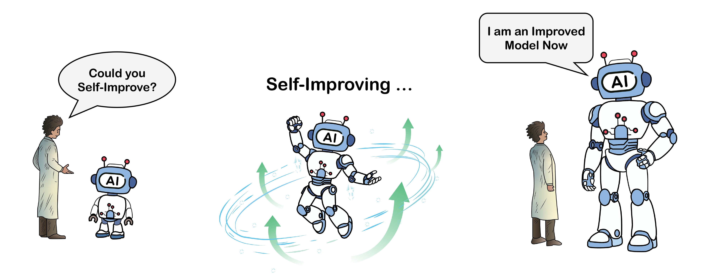
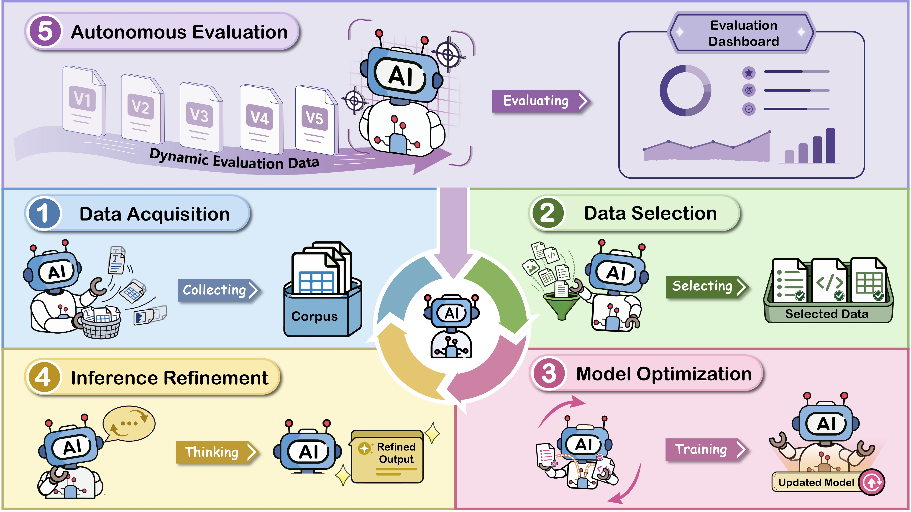

<div align="center">

# Self-Improvement of Large Language Models: A Technical Overview and Future Outlook

<h3 style="margin-top: 0.25rem;">
  Haoyan Yang · Mario Xerri · Solha Park · Huajian Zhang
  <br>
  Yiyang Feng · Sai Akhil Kogilathota · Jiawei Zhou
  <br><br>
  Zesearch NLP Lab, Stony Brook University
</h3>



</div>

<h3 align="center">
  <a href="https://arxiv.org/abs/2603.25681v3">Paper</a> ·
  <a href="https://zesearch.github.io/self-improvement-llm-website/">Website</a> ·
  <a href="https://github.com/Zesearch/self-improvement-llm">GitHub</a>
</h3>

# News

- **[2026.09]** 🚀 We implemented the blueprint presented in this survey and released **Zevo**, a multi-agent self-improving system for evolving language models. See the [**website**](https://zevoai.dev) and [**GitHub repository**](https://github.com/Zesearch/Zevo) for details.
- **[2026.09]** 🚀 We released the [**TMLR camera-ready version**](https://arxiv.org/abs/2603.25681v3) of our survey, with several recent references added.
- **[2026.08]** 🚀 We released a [**new version**](https://arxiv.org/abs/2603.25681v2) of our paper, with a restructured **Model Optimization (§4)**, a new section on **Potential Risks (§8)**, and an expanded **Applications (§9)**.
- **[2026.08]** 🎉 Our paper was accepted to [**TMLR**](https://jmlr.org/tmlr/) and awarded a [**Survey Certification**](https://jmlr.org/tmlr/papers/)!
- **[2026.08]** 🎉 Our paper was covered by [**SBU News**](https://news.stonybrook.edu/academics/college-of-engineering-and-applied-sciences/stony-brook-researchers-create-a-blueprint-for-self-improving-language-models/).
- **[2026.06]** 🎉 Our paper was covered by [**机器之心 (Synced)**](https://mp.weixin.qq.com/s/N_qd_beuSQ4zMcJAActTaQ).

📚 *Continuous Update*

We will continuously update the latest literature on self-improvement of LLMs in this repository.

🤝 *Collaboration Welcome*

If you are also interested in self-improvement of LLMs or self-evolving agents, feel free to reach out!


# Overview
As large language models (LLMs) continue to advance, relying solely on human supervision for further improvement is becoming increasingly difficult to scale. This shift is driven by two key factors:

- **Limits of human supervision:** High-quality expert data is costly and scarce, while human feedback may become less informative as models approach or exceed human-level performance in specialized domains.
- **Opportunities for autonomy:** Increasingly capable models can generate data, evaluate outputs, make decisions, and execute complex actions, enabling more of the model development process to be automated.

We envision a paradigm in which **humans only bootstrap the system**, after which the model autonomously acquires its own data, reflects on its own outputs, and iteratively refines its own capabilities. In the long run, model development becomes a self-sustaining loop rather than a human-driven pipeline, potentially enabling systems to evolve beyond human-level intelligence.

<p align="center">
  
</p>


We present a **system-level framework for self-improving language models**, covering the full lifecycle of autonomous model development. We organize existing research into **five key components** of a self-improvement system:

- **Data Acquisition**
- **Data Selection**
- **Model Optimization**
- **Inference Refinement**
- **Autonomous Evaluation**

Beyond the technical taxonomy, we further analyze the field from four complementary perspectives:

- **Challenges and Limitations**
- **Potential Risks**
- **Applications**
- **Future Outlook**

Our goal is to provide a unified perspective on self-improvement systems and share our vision for building scalable and autonomous self-improving systems.


# Paper List

📌 **Note:** Each section and subsection heading in this paper list is annotated with its corresponding section number in the paper (e.g., `§2.2`, `§4.3`), along with a brief description of its scope.

<details>
<summary><b>Contents (Click to expand or collapse)</b></summary>

<br>

- [Data Acquisition (§2)](#data-acquisition-2)
  - [Static Curation (§2.2)](#static-curation-22)
  - [Environment Interaction (§2.3)](#environment-interaction-23)
  - [Synthetic Generation (§2.4)](#synthetic-generation-24)
    - [Prompt-Based (§2.4.1)](#prompt-based-241)
    - [Transformation-Based (§2.4.2)](#transformation-based-242)
    - [Interaction-Based (§2.4.3)](#interaction-based-243)

- [Data Selection (§3)](#data-selection-3)
  - [Metric-Guided Scoring (§3.2)](#metric-guided-scoring-32)
    - [One-Shot Scoring (§3.2.1)](#one-shot-scoring-321)
    - [Iterative Re-Scoring (§3.2.2)](#iterative-re-scoring-322)
  - [Adaptive Selection (§3.3)](#adaptive-selection-33)

- [Model Optimization (§4)](#model-optimization-4)
  - [Direct Optimization (§4.2)](#direct-optimization-42)
  - [Self-Generated Optimization (§4.3)](#self-generated-optimization-43)
    - [Generation, Reward, and Optimization (§4.3.1 to §4.3.3)](#generation-reward-and-optimization-431-to-433)
    - [Representative Instances of SGO (§4.3.4)](#representative-instances-of-sgo-434)
  - [Self-Evolving Optimization (§4.4)](#self-evolving-optimization-44)
  - [Theoretical Analysis (§4.5.1)](#theoretical-analysis-451)

- [Inference Refinement (§5)](#inference-refinement-5)
  - [Decoding Strategies (§5.2)](#decoding-strategies-52)
    - [Sampling-Based (§5.2.1)](#sampling-based-521)
    - [Tree Search (§5.2.2)](#tree-search-522)
    - [Logit and Probability Adjustments (§5.2.3)](#logit-and-probability-adjustments-523)
    - [Efficiency-Oriented Methods (§5.2.4)](#efficiency-oriented-methods-524)
  - [Reasoning-Based Improvement (§5.3)](#reasoning-based-improvement-53)
    - [Feedback-Based Reasoning (§5.3.1)](#feedback-based-reasoning-531)
    - [Planning-Based Reasoning (§5.3.2)](#planning-based-reasoning-532)
    - [Collaborative Reasoning (§5.3.3)](#collaborative-reasoning-533)
  - [Agentic System Improvement (§5.4)](#agentic-system-improvement-54)
    - [Prompts (§5.4.1)](#prompts-541)
    - [Memory (§5.4.2)](#memory-542)
    - [Tooling (§5.4.3)](#tooling-543)
    - [Workflow and System Evolution (§5.4.4)](#workflow-and-system-evolution-544)
  - [Test-Time Training (§5.5)](#test-time-training-55)
    - [TT-SFT (§5.5)](#tt-sft-55)
    - [TT-RL (§5.5)](#tt-rl-55)

- [Autonomous Evaluation (§6)](#autonomous-evaluation-6)
  - [Dynamic Benchmarking (§6.2)](#dynamic-benchmarking-62)
  - [Interactive Environment Evaluation (§6.3)](#interactive-environment-evaluation-63)

- [Challenges and Limitations (§7)](#challenges-and-limitations-7)
  - [Data Autophagy (§7.1)](#data-autophagy-71)
  - [Flawed Feedback Signals (§7.2)](#flawed-feedback-signals-72)
  - [Optimization-Driven Failures (§7.3)](#optimization-driven-failures-73)
  - [Ineffective Self-Refinement (§7.4)](#ineffective-self-refinement-74)
  - [Evaluation Bottlenecks (§7.5)](#evaluation-bottlenecks-75)
  - [Supervision Bottlenecks (§7.6)](#supervision-bottlenecks-76)
  - [Budget Constraints (§7.7)](#budget-constraints-77)

- [Potential Risks (§8)](#potential-risks-8)
  - [Loss of Control (§8.1)](#loss-of-control-81)
  - [High-Stakes Harm (§8.2)](#high-stakes-harm-82)
  - [Social and Ethical Risks (§8.3)](#social-and-ethical-risks-83)
  - [Misuse Risks (§8.4)](#misuse-risks-84)

- [Applications (§9)](#applications-9)
  - [Code](#code)
  - [Math](#math)
  - [Healthcare](#healthcare)
  - [Finance](#finance)
  - [Science](#science)
  - [Auto Research](#auto-research)


</details>


## Data Acquisition (§2)

> **§2 Data Acquisition** is the first stage of the self-improvement lifecycle. The model autonomously collects or generates the raw materials necessary for its own evolution, progressing from external discovery (curation) to external exploration (interaction) to internal generation (synthesis).


### Static Curation (§2.2)

> **§2.2 Static Curation** acquires raw data from fixed, externally hosted sources (web, code, books), where the model acts as an autonomous data-collecting agent that navigates massive repositories to identify, prioritize, and curate the corpora most valuable for its own evolution.

#### Web Content

- [(2023, Mar) [NeurIPS 2022] The BigScience ROOTS Corpus: A 1.6TB Composite Multilingual Dataset](https://arxiv.org/pdf/2303.03915)
- [(2023, Sep) [LREC-COLING 2024] CulturaX: A Cleaned, Enormous, and Multilingual Dataset for Large Language Models in 167 Languages](https://arxiv.org/pdf/2309.09400)
- [(2024, Mar) [LREC-COLING 2024] A New Massive Multilingual Dataset for High-Performance Language Technologies](https://aclanthology.org/2024.lrec-main.100.pdf)
- [(2024, Jun) [NeurIPS 2024] The FineWeb Datasets: Decanting the Web for the Finest Text Data at Scale](https://arxiv.org/pdf/2406.17557)
- [(2024, Jun) [NeurIPS 2024] DataComp-LM: In search of the next generation of training sets for language models](https://arxiv.org/pdf/2406.11794)
- [(2025, Feb) [ACL 2025 Findings] Craw4LLM: Efficient Web Crawling for LLM Pretraining](https://aclanthology.org/2025.findings-acl.712.pdf)

#### Code and Scientific Text
- [(2019, Nov) [ACL 2020] S2ORC: The Semantic Scholar Open Research Corpus](https://aclanthology.org/2020.acl-main.447.pdf)
- [(2023, Oct) [ICLR 2024] OpenWebMath: An Open Dataset of High-Quality Mathematical Web Text](https://arxiv.org/pdf/2310.06786)
- [(2024, Feb) StarCoder 2 and The Stack v2: The Next Generation](https://arxiv.org/pdf/2402.19173)

#### Books

- [(2015, Dec) [ICCV 2015] Aligning Books and Movies: Towards Story-Like Visual Explanations by Watching Movies and Reading Books](https://arxiv.org/abs/1506.06724)
- [(2020, Dec) The Pile: An 800GB Dataset of Diverse Text for Language Modeling](https://arxiv.org/pdf/2101.00027)
- [(2024) [NeurIPS 2024 D&B] RedPajama: An Open Dataset for Training Large Language Models](https://openreview.net/forum?id=lnuXaRpwvw)

#### Automatic Data Preparation

- [(2026, Jan) Can LLMs Clean Up Your Mess? A Survey of Application-Ready Data Preparation with LLMs](https://arxiv.org/abs/2601.17058)


### Environment Interaction (§2.3)

> **§2.3 Environment Interaction** enables the model to acquire data by actively interacting with external environments — browsing website, calling APIs, executing code, or operating within simulators — and learning from the resulting feedback through trial and error.

#### Web and Tool Environments
- [(2021, Dec) WebGPT: Browser-assisted question-answering with human feedback](https://arxiv.org/pdf/2112.09332)
- [(2023, Feb) [NeurIPS 2023] Toolformer: Language Models Can Teach Themselves to Use Tools](https://arxiv.org/pdf/2302.04761)
- [(2025, Feb) InSTA: Towards Internet-Scale Training For Agents](https://arxiv.org/pdf/2502.06776)
- [(2025, Jun) Go-Browse: Training Web Agents with Structured Exploration](https://arxiv.org/pdf/2506.03533)
- [(2025, Oct) [TMLR] BrowserAgent: Building Web Agents with Human-Inspired Web Browsing Actions](https://arxiv.org/pdf/2510.10666)
- [(2026, Jan) EnvScaler: Scaling Tool-Interactive Environments for LLM Agent via Programmatic Synthesis](https://arxiv.org/pdf/2601.05808)


#### Code Execution
- [(2023, Jun) [ICSE 2024] TRACED: Execution-aware Pre-training for Source Code](https://arxiv.org/pdf/2306.07487)
- [(2024, Oct) [ICML 2025] RLEF: Grounding Code LLMs in Execution Feedback with Reinforcement Learning](https://arxiv.org/pdf/2410.02089)
- [(2025, Jan) Learn-by-interact: A Data-Centric Framework for Self-Adaptive Agents in Realistic Environments](https://arxiv.org/pdf/2501.10893)
- [(2025, Sep) Scaling Agents via Continual Pre-training](https://arxiv.org/pdf/2509.13310)
- [(2025, Sep) CWM: An Open-Weights LLM for Research on Code Generation with World Models](https://arxiv.org/pdf/2510.02387)
- [(2025, Oct) CodeRL+: Improving Code Generation via Reinforcement with Execution Semantics Alignment](https://arxiv.org/pdf/2510.18471)

#### Game Environments
- [(2023, Apr) [UIST 2023] Generative Agents: Interactive Simulacra of Human Behavior](https://arxiv.org/pdf/2304.03442)
- [(2023, Nov) [COLING 2025] ALYMPICS: LLM Agents Meet Game Theory](https://aclanthology.org/2025.coling-main.193.pdf)
- [(2025, Dec) Understanding LLM Agent Behaviours via Game Theory: Strategy Recognition, Biases and Multi-Agent Dynamics](https://arxiv.org/pdf/2512.07462)

### Synthetic Generation (§2.4)

> **§2.4 Synthetic Generation** is where the model completely detaches from external environments and uses its intrinsic capabilities to produce entirely new training data — instructions, reasoning chains, or dialogues — through prompting, transformation, or multi-model interaction.

#### Prompt-Based (§2.4.1)

> **§2.4.1 Prompt-Based Generation** uses an LLM to generate new training examples from scratch or from seed examples via carefully designed prompts, iteratively amplifying a small set of seeds into a large corpus.

- [(2022, Dec) [ACL 2023] Self-Instruct: Aligning Language Models with Self-Generated Instructions](https://arxiv.org/pdf/2212.10560)
- [(2023, Apr) [ICLR 2024] WizardLM: Empowering Large Pre-Trained Language Models to Follow Complex Instructions](https://arxiv.org/pdf/2304.12244)
- [(2023, May) TinyStories: How Small Can Language Models Be and Still Speak Coherent English?](https://arxiv.org/pdf/2305.07759)
- [(2023, Jun) [NeurIPS 2023] Large Language Model as Attributed Training Data Generator: A Tale of Diversity and Bias](https://arxiv.org/pdf/2306.15895)
- [(2023, Jun) Textbooks Are All You Need](https://arxiv.org/pdf/2306.11644)
- [(2023, Sep) Textbooks Are All You Need II: phi-1.5 technical report](https://arxiv.org/pdf/2309.05463)
- [(2024, Mar) Cosmopedia: how to create large-scale synthetic data for pre-training](https://huggingface.co/blog/cosmopedia)
- [(2024, Apr) Phi-3 Technical Report: A Highly Capable Language Model Locally on Your Phone](https://arxiv.org/pdf/2404.14219)
- [(2024, Apr) [Findings of NAACL 2024] CodecLM: Aligning Language Models with Tailored Synthetic Data](https://arxiv.org/pdf/2404.05875)
- [(2024, Oct) [ICLR 2025] MIND: Math Informed syNthetic Dialogues for Pretraining LLMs](https://arxiv.org/pdf/2410.12881)
- [(2024, Oct) [MATH-AI Workshop, NeurIPS 2024] Constraint-Based Synthetic Data Generation for LLM Mathematical Reasoning](https://files.sri.inf.ethz.ch/z3_llm/z3_llm.pdf)
- [(2024, Dec) Phi-4 Technical Report](https://arxiv.org/pdf/2412.08905)
- [(2025, Jul) CoT-Self-Instruct: Building high-quality synthetic prompts for reasoning and non-reasoning tasks](https://arxiv.org/pdf/2507.23751)
- [(2026, Jun) Autodata: An Agentic Data Scientist to Create High Quality Synthetic Data](https://arxiv.org/abs/2606.25996)
- [(2026, Jul) [ACL 2026] Aligning Large Language Models via Fully Self-Synthetic Data](https://aclanthology.org/2026.acl-long.1595/)

#### Transformation-Based (§2.4.2)

> **§2.4.2 Transformation-Based Generation** takes an existing corpus as input and uses an LLM to rewrite, reformat, or extract new training examples, converting raw data into more structured or pedagogically useful forms.

- [(2024, Jan) [ACL 2024] Rephrasing the Web: A Recipe for Compute and Data-Efficient Language Modeling](https://arxiv.org/pdf/2401.16380)
- [(2024, Jun) [EMNLP 2024] Instruction Pre-Training: Language Models are Supervised Multitask Learners](https://arxiv.org/pdf/2406.14491)
- [(2025, Feb) Synthetic Text Generation for Training Large Language Models via Gradient Matching](https://arxiv.org/pdf/2502.17607)
- [(2025, Mar) Scaling Laws of Synthetic Data for Language Models](https://arxiv.org/pdf/2503.19551)
- [(2025, Sep) Synthetic bootstrapped pretraining](https://arxiv.org/pdf/2509.15248)

#### Interaction-Based (§2.4.3)

> **§2.4.3 Interaction-Based Generation** produces training data through multi-turn dialogue or self-play between model instances, where interactions between agents generate diverse reasoning chains and dialogues without external data sources.

- [(2018, Jan) Building a Conversational Agent Overnight with Dialogue Self-Play](https://arxiv.org/pdf/1801.04871)
- [(2023, Apr) [EMNLP 2023] Baize: An Open-Source Chat Model with Parameter-Efficient Tuning on Self-Chat Data](https://arxiv.org/pdf/2304.01196)
- [(2024, Jan) [ICML 2024] Self-Play Fine-Tuning Converts Weak Language Models to Strong Language Models](https://arxiv.org/pdf/2401.01335)
- [(2025, Jul) [SIGDIAL 2025] Exploring the Design of Multi-Agent LLM Dialogues for Research Ideation](https://aclanthology.org/2025.sigdial-1.26.pdf)
- [(2025, Aug) ALAS: Autonomous Learning Agent for Self-Updating Language Models](https://arxiv.org/pdf/2508.15805)
- [(2025, Aug) [ICLR 2026] R-Zero: Self-Evolving Reasoning LLM from Zero Data](https://arxiv.org/pdf/2508.05004)
- [(2025, Sep) Language Self-Play For Data-Free Training](https://arxiv.org/pdf/2509.07414)
- [(2025, Nov) [EMNLP 2025] Empowering Math Problem Generation and Reasoning for Large Language Model via Synthetic Data based Continual Learning Framework](https://aclanthology.org/2025.emnlp-main.1223.pdf)
- [(2026, Mar) EigenData: A Self-Evolving Multi-Agent Platform for Function-Calling Data Synthesis, Auditing, and Repair](https://arxiv.org/abs/2603.05553)


## Data Selection (§3)

> **§3 Data Selection** focuses on how the model independently evaluates and filters which data points are of higher quality and better suited for its own learning, transforming the model from a passive data consumer into an active data curator.


### Metric-Guided Scoring (§3.2)

> **§3.2 Metric-Guided Scoring** applies predefined scoring metrics derived from model signals (perplexity, influence scores, reward model outputs) to rank and filter data, enabling the model to act as its own evaluator for data quality.

#### One-Shot Scoring (§3.2.1)

> **§3.2.1 One-Shot Scoring** computes selection scores once before training begins, using a fixed snapshot of the model's capabilities to evaluate and rank data points for inclusion in the training set.

- [(2022, Jul) [ICML 2022] GLaM: Efficient Scaling of Language Models with Mixture-of-Experts](https://proceedings.mlr.press/v162/du22c/du22c.pdf)
- [(2023, Jul) [ACL 2023 Findings] Data-Efficient Finetuning Using Cross-Task Nearest Neighbors](https://aclanthology.org/2023.findings-acl.576.pdf)
- [(2023, Aug) [JMLR 2023] PaLM: Scaling language modeling with pathways](https://www.jmlr.org/papers/volume24/22-1144/22-1144.pdf)
- [(2023, Nov) Self-Evolved Diverse Data Sampling for Efficient Instruction Tuning](https://arxiv.org/pdf/2311.08182)
- [(2023, Dec) [NeurIPS 2023 Workshop: ATTRIB] When Less is More: Investigating Data Pruning for Pretraining LLMs at Scale](https://openreview.net/pdf?id=XUIYn3jo5T)
- [(2023, Dec) [NeurIPS 2023] DoReMi: Optimizing Data Mixtures Speeds Up Language Model Pretraining](https://proceedings.neurips.cc/paper_files/paper/2023/file/dcba6be91359358c2355cd920da3fcbd-Paper-Conference.pdf)
- [(2023, Dec) [NeurIPS 2023] Data Selection for Language Models via Importance Resampling](https://proceedings.neurips.cc/paper_files/paper/2023/file/6b9aa8f418bde2840d5f4ab7a02f663b-Paper-Conference.pdf)
- [(2024, May) [ICLR 2024] AlpaGasus: Training a Better Alpaca with Fewer Data](https://openreview.net/pdf?id=FdVXgSJhvz)
- [(2024, May) [ICLR 2024] What Makes Good Data for Alignment? A Comprehensive Study of Automatic Data Selection in Instruction Tuning](https://openreview.net/pdf?id=BTKAeLqLMw)
- [(2024, Jul) [ICML 2024] LESS: Selecting Influential Data for Targeted Instruction Tuning](https://openreview.net/pdf?id=PG5fV50maR)
- [(2024, Aug) [ACL 2024] One-Shot Learning as Instruction Data Prospector for Large Language Models](https://aclanthology.org/2024.acl-long.252.pdf)
- [(2024, Aug) [ACL 2024 Findings] Smaller Language Models are capable of selecting Instruction-Tuning Training Data for Larger Language Models](https://aclanthology.org/2024.findings-acl.623.pdf)
- [(2024, Dec) [NeurIPS 2024] SmallToLarge (S2L): Scalable Data Selection for Fine-tuning Large Language Models by Summarizing Training Trajectories of Small Models](https://proceedings.neurips.cc/paper_files/paper/2024/file/97fe251c25b6f99a2a23b330a75b11d4-Paper-Conference.pdf)
- [(2024, Dec) [NeurIPS 2024] SelectIT: Selective Instruction Tuning for LLMs via Uncertainty-Aware Self-Reflection](https://openreview.net/pdf?id=QNieOPt4fg)
- [(2025, Apr) [ICLR 2025] Perplexed by Perplexity: Perplexity-Based Data Pruning With Small Reference Models](https://openreview.net/pdf?id=1GTARJhxtq)
- [(2025, Apr) [ICLR 2025] Improving Pretraining Data Using Perplexity Correlations](https://openreview.net/pdf?id=huuKoVQnB0)
- [(2025, Apr) [WWW 2025] Automatic Instruction Data Selection for Large Language Models via Uncertainty-Aware Influence Maximization](https://openreview.net/pdf?id=yvN3PilD1S)
- [(2025, Dec) [NeurIPS 2025] T-SHIRT: Token-Selective Hierarchical Data Selection for Instruction Tuning](https://openreview.net/pdf?id=oN5YVZ9JeF))
- [(2025, Dec) [NeurIPS 2025] Balanced Locality-Sensitive Hashing for Online Data Selection](https://arxiv.org/pdf/2311.08182)
- [(2026, Apr) [ICLR 2026] Influence-Preserving Proxies for Gradient-Based Data Selection in LLM FineTuning](https://openreview.net/pdf?id=PDNpRLxDlI)

#### Iterative Re-Scoring (§3.2.2)

> **§3.2.2 Iterative Re-Scoring** periodically refreshes data quality scores as the model evolves during training, enabling online curriculum learning that adapts data selection to the model's changing capability frontier.

- [(2020, Oct) [CIKM 2020] Carpe Diem, Seize the Samples Uncertain "at the Moment" for Adaptive Batch Selection](https://dl.acm.org/doi/pdf/10.1145/3340531.3411898)
- [(2022, Jul) [ICML 2022] Prioritized training on points that are learnable, worth learning, and not yet learnt](https://proceedings.mlr.press/v162/mindermann22a/mindermann22a.pdf)
- [(2023, Dec) [EMNLP 2023] Active Instruction Tuning: Improving Cross-Task Generalization by Training on Prompt Sensitive Tasks](https://aclanthology.org/2023.emnlp-main.112.pdf)
- [(2024, May) [LREC-COLING 2024] IT2ACL Learning Easy-to-Hard Instructions via 2-Phase Automated Curriculum Learning for Large Language Models](https://aclanthology.org/2024.lrec-main.822.pdf)
- [(2024, Jun) [NAACL 2024] From Quantity to Quality: Boosting LLM Performance with Self-Guided Data Selection for Instruction Tuning](https://aclanthology.org/2024.naacl-long.421.pdf)
- [(2024, Aug) P3: A Policy-Driven, Pace-Adaptive, and Diversity-Promoted Framework for data pruning in LLM Training](https://arxiv.org/pdf/2408.05541)
- [(2024, Oct) IterSelectTune: An Iterative Training Framework for Efficient Instruction-Tuning Data Selection](https://arxiv.org/pdf/2410.13464)
- [(2024, Dec) [NeurIPS 2024] GREATS: Online Selection of High-Quality Data for LLM Training in Every Iteration](https://openreview.net/pdf?id=232VcN8tSx)
- [(2025, Apr) [ICLR 2025] Automatic Curriculum Expert Iteration for Reliable LLM Reasoning](https://openreview.net/pdf?id=3ogIALgghF)
- [(2025, Apr) Efficient Reinforcement Finetuning via Adaptive Curriculum Learning](https://arxiv.org/pdf/2504.05520)
- [(2025, Apr) Online Difficulty Filtering for Reasoning Oriented Reinforcement Learning](https://arxiv.org/pdf/2504.03380)
- [(2025, Jun) [TMLR 2025] Spaced Scheduling for Large Language Model Training](https://openreview.net/pdf?id=p0KTYl2B9T)
- [(2025, Jun) LearnAlign: Reasoning Data Selection for Reinforcement Learning in Large Language Models Based on Improved Gradient Alignment](https://arxiv.org/pdf/2506.11480)
- [(2025, Nov) [EMNLP 2025] Language Models as Continuous Self-Evolving Data Engineers](https://aclanthology.org/2025.emnlp-main.914.pdf)
- [(2025, Dec) [NeurIPS 2025 Workshop: ER] Efficient Reinforcement Learning for Large Language Models with Intrinsic Exploration](https://openreview.net/pdf?id=0VuuZ8sKpZ)
- [(2025, Dec) [NeurIPS 2025] AdaSTaR: Adaptive Data Sampling for Training Self-Taught Reasoners](https://openreview.net/pdf?id=D6PwC6Xogv)

### Adaptive Selection (§3.3)

> **§3.3 Adaptive Selection** introduces a learnable selector that dynamically chooses training data based on the model's evolving state, going beyond fixed metrics to co-evolve the selection policy alongside the model being trained.

- [(2024, Jun) [ECML PKDD 2025] Active Preference Optimization for Sample Efficient RLHF](https://openreview.net/pdf?id=uSCvfYNn0s)
- [(2024, Dec) [NeurIPS 2024] MATES: Model-Aware Data Selection for Efficient Pretraining with Data Influence Models](https://proceedings.neurips.cc/paper_files/paper/2024/file/c4bec0d2fd217e6c2c3eafeced432582-Paper-Conference.pdf)
- [(2025, Apr) [ICLR 2025] SEAL: Safety-enhanced Aligned LLM Fine-tuning via Bilevel Data Selection](https://openreview.net/pdf?id=VHguhvcoM5)
- [(2025, Apr) DUMP: Automated Distribution-Level Curriculum Learning for RL-based LLM Post-training](https://arxiv.org/pdf/2504.09710)
- [(2025, May) Self-Evolving Curriculum for LLM Reasoning](https://arxiv.org/pdf/2505.14970)
- [(2025, Jul) [ACL 2025] Efficient Pretraining Data Selection for Language Models via Multi-Actor Collaboration](https://aclanthology.org/2025.acl-long.466.pdf)
- [(2025, Jul) [ACL 2025] ScaleBiO: Scalable Bilevel Optimization for LLM Data Reweighting](https://aclanthology.org/2025.acl-long.1543.pdf)
- [(2025, Aug) SPaRFT: Self-Paced Reinforcement Fine-Tuning for Large Language Models](https://arxiv.org/pdf/2508.05015)
- [(2025, Nov) [EMNLP 2025 Findings] RAISE: Reinforced Adaptive Instruction Selection For Large Language Models](https://aclanthology.org/2025.findings-emnlp.628.pdf)
- [(2025, Nov) [EMNLP 2025 Findings] Scale Down to Speed Up: Dynamic Data Selection for Reinforcement Learning](https://aclanthology.org/2025.findings-emnlp.412.pdf)
- [(2025, Dec) [NeurIPS 2025] Group-Level Data Selection for Efficient Pretraining](https://openreview.net/pdf?id=uX4dyc7Z5Z)
- [(2025, Dec) [NeurIPS 2025 Workshop: Reliable ML from Unreliable Data] RL-Guided Data Selection for Language Model Finetuning](https://openreview.net/pdf?id=YfMIkHYxP0)
- [(2026, Jan) [ICML 2026] Teaching Models to Teach Themselves: Reasoning at the Edge of Learnability](https://arxiv.org/abs/2601.18778)
- [(2026, Apr) Joint Selection for Large-Scale Pre-Training Data via Policy Gradient-based Mask Learning](https://openreview.net/pdf?id=fs2uDib85s)
- [(2026, Jul) [ACL 2026] Counteracting the Matthew Effect in Self-Improvement of LVLMs through Head-Tail Re-balancing](https://aclanthology.org/2026.acl-long.1010/)
- [(2026, Jul) [ACL 2026 Findings] DynamixSFT: Dynamic Mixture Optimization of Instruction Tuning Collections](https://aclanthology.org/2026.findings-acl.1972/)
- [(2026, Jul) [ACL 2026 Findings] EvoCoT: Overcoming the Exploration Bottleneck in Reinforcement Learning for LLMs](https://aclanthology.org/2026.findings-acl.1031/)


## Model Optimization (§4)

> **§4 Model Optimization** is the core training stage where the model autonomously converts acquired and selected data into enhanced capabilities within its parameters. The paper organizes it into three paradigms that form a progression of increasing autonomy: **Direct Optimization** (§4.2), a single offline update on a fixed corpus; **Self-Generated Optimization (SGO)** (§4.3), a closed loop of generation, reward, and optimization; and **Self-Evolving Optimization** (§4.4), where the optimization procedure itself becomes the object of improvement.

### Direct Optimization (§4.2)

> **§4.2 Direct Optimization** updates the model offline on a fixed dataset assembled by the upstream acquisition and selection stages. The corpus is frozen before optimization begins, no candidate is resampled from the updated model, and the training distribution stays stationary. The sophistication lies in how the data is produced rather than in how the parameters are updated.

- [(2022, Dec) [ACL 2023] Self-Instruct: Aligning Language Models with Self-Generated Instructions](https://arxiv.org/pdf/2212.10560)
- [(2023, Apr) [ICLR 2024] WizardLM: Empowering Large Pre-Trained Language Models to Follow Complex Instructions](https://arxiv.org/pdf/2304.12244)
- [(2023, Aug) [ICLR 2024] Self-Alignment with Instruction Backtranslation](https://openreview.net/pdf?id=1oijHJBRsT)
- [(2023, Oct) [ACL 2024 Findings] AgentTuning: Enabling Generalized Agent Abilities for LLMs](https://aclanthology.org/2024.findings-acl.181.pdf)
- [(2023, Oct) FireAct: Toward Language Agent Fine-tuning](https://arxiv.org/pdf/2310.05915)
- [(2024, Apr) [NAACL 2024 Findings] CodecLM: Aligning Language Models with Tailored Synthetic Data](https://arxiv.org/pdf/2404.05875)
- [(2024, Jun) [ICLR 2025] Magpie: Alignment Data Synthesis from Scratch by Prompting Aligned LLMs with Nothing](https://openreview.net/pdf?id=Pnk7vMbznK)
- [(2025, Jan) Learn-by-Interact: A Data-Centric Framework for Self-Adaptive Agents in Realistic Environments](https://arxiv.org/pdf/2501.10893)
- [(2025, May) [NeurIPS 2025] LongMagpie: A Self-Synthesis Method for Generating Large-Scale Long-Context Instructions](https://openreview.net/pdf?id=tuA2R6gZEA)
- [(2026, Jul) [ACL 2026] Aligning Large Language Models via Fully Self-Synthetic Data](https://aclanthology.org/2026.acl-long.1595/)


### Self-Generated Optimization (§4.3)

> **§4.3 Self-Generated Optimization (SGO)** is the primary focus of this stage. Unlike direct optimization, the corpus is no longer fixed in advance: the model repeatedly **generates** the experience it trains on, receives a **reward** for it, and **optimizes** on the result, so the training distribution is policy-induced and non-stationary. SGO is therefore a specialized form of reinforcement learning in which the model learns from experience it produces itself.

#### Generation, Reward, and Optimization (§4.3.1 to §4.3.3)

> **§4.3.1 Generation** categorizes how candidates are produced: **Self-Exploratory (SE)** sampling directly from the current policy, **Refined (R)** generation that iteratively improves an initial response, and **Interactive (I)** generation driven by collaborative, adversarial, or tool-augmented dynamics.
>
> **§4.3.2 Reward** categorizes how those candidates are scored: **Heuristic (H)** signals from consistency or hand-designed rules, **Model-Based (M)** signals from self-evaluation or external judges and reward models, and **Verification (V)** signals from ground-truth matching, formal provers, or code execution.
>
> **§4.3.3 Optimization** follows directly from the reward format: SFT on filtered samples, DPO-style objectives on preference orderings, PPO/GRPO on scalar rewards, or specialized self-play objectives.

The table below organizes SGO methods by their generation strategy, reward type, and optimization method (mirroring Table 6 of the paper). Abbreviations: **SE** = Self-Exploratory, **R** = Refined, **I** = Interactive; **H** = Heuristic, **M** = Model-Based, **V** = Verification. `&` indicates that multiple techniques are used within the same stage.

| Method | Generation | Reward | Optimization |
|--------|------------|--------|--------------|
| [(2022, Mar) [NeurIPS 2022] STaR: Bootstrapping Reasoning With Reasoning](https://arxiv.org/pdf/2203.14465) | SE | V | SFT |
| [(2023, May) [ICLR 2024] SIRLC: Language Model Self-improvement by Reinforcement Learning Contemplation](https://arxiv.org/pdf/2305.14483) | SE | M | PPO |
| [(2023, Oct) SELF: Self-Evolution with Language Feedback](https://arxiv.org/pdf/2310.00533) | R | M & V | SFT |
| [(2023, Dec) [EMNLP 2023] LMSI: Large Language Models Can Self-Improve](https://aclanthology.org/2023.emnlp-main.67.pdf) | SE | H | SFT |
| [(2024, Jan) [ICML 2024] SPIN: Self-Play Fine-Tuning Converts Weak Language Models to Strong Language Models](https://arxiv.org/pdf/2401.01335) | SE | H | SPIN |
| [(2024, May) [ICML 2024] Self-Rewarding Language Models](https://openreview.net/pdf?id=0NphYCmgua) | SE | M | DPO |
| [(2024, May) [ICLR 2025] SPPO: Self-Play Preference Optimization for Language Model Alignment](https://arxiv.org/pdf/2405.00675) | SE | M | SPPO |
| [(2024, Jun) [NAACL 2024] TRIPOST: Teaching Language Models to Self-Improve through Interactive Demonstrations](https://aclanthology.org/2024.naacl-long.287.pdf) | R | M | SFT |
| [(2024, Jun) [NeurIPS 2024] ReST-MCTS*: LLM Self-Training via Process Reward Guided Tree Search](https://arxiv.org/pdf/2406.03816) | SE | M | SFT |
| [(2024, Jul) [NeurIPS 2024] RISE: Recursive Introspection: Teaching Language Model Agents How to Self-Improve](https://openreview.net/pdf?id=DRC9pZwBwR) | R | M & V | SFT |
| [(2024, Jul) [COLM 2024] V-STaR: Training Verifiers for Self-Taught Reasoners](https://arxiv.org/pdf/2402.06457) | SE | V | SFT & DPO |
| [(2024, Jul) Meta-Rewarding Language Models: Self-Improving Alignment with LLM-as-a-Meta-Judge](https://arxiv.org/pdf/2407.19594v2) | SE | M | DPO |
| [(2024, Aug) [AAAI 2025] IWSI: Importance Weighting Can Help Large Language Models Self-Improve](https://arxiv.org/pdf/2408.09849) | SE | H & M | SFT |
| [(2024, Sep) [ICLR 2025] SCoRe: Training Language Models to Self-Correct via Reinforcement Learning](https://arxiv.org/pdf/2409.12917) | R | V | Multi-turn RL |
| [(2024, Oct) [ICLR 2025] ReGenesis: LLMs can Grow into Reasoning Generalists via Self-Improvement](https://arxiv.org/pdf/2410.02108) | SE & R | H & V | SFT |
| [(2024, Oct) [ICLR 2025] SynPO: Self-Boosting Large Language Models with Synthetic Preference Data](https://arxiv.org/pdf/2410.06961) | R | H | DPO |
| [(2024, Nov) [ICML 2025] ScPO: Self-Consistency Preference Optimization](https://arxiv.org/pdf/2411.04109) | SE | H | ScPO |
| [(2025, Jan) [ICLR 2025] Multiagent Finetuning: Self Improvement with Diverse Reasoning Chains](https://arxiv.org/pdf/2501.05707) | I | H | SFT |
| [(2025, Feb) [NeurIPS 2025] SiriuS: Self-improving Multi-agent Systems via Bootstrapped Reasoning](https://arxiv.org/pdf/2502.04780) | I | V | SFT |
| [(2025, Feb) DNPO: Dynamic Noise Preference Optimization: Self-Improvement of Large Language Models with Self-Synthetic Data](https://arxiv.org/pdf/2502.05400) | SE | M | DNPO |
| [(2025, Feb) [COLM 2025] Goedel-Prover: A Frontier Model for Open-Source Automated Theorem Proving](https://arxiv.org/pdf/2502.07640) | SE | V | SFT & DPO |
| [(2025, Feb) SOL-VER: Learning to Solve and Verify: A Self-Play Framework for Code and Test Generation](https://arxiv.org/pdf/2502.14948) | SE | M & V | SFT & DPO |
| [(2025, Feb) RSPO: Regularized Self-Play Alignment of Large Language Models](https://arxiv.org/pdf/2503.00030) | SE | M | RSPO |
| [(2025, Feb) Self-Rewarding Correction for Mathematical Reasoning](https://arxiv.org/pdf/2502.19613) | R | V | SFT & RL |
| [(2025, Mar) STaSC: Self-Taught Self-Correction for Small Language Models](https://arxiv.org/pdf/2503.08681) | R | V | SFT |
| [(2025, Mar) SPHERE: Self-Evolved Preference Optimization for Enhancing Mathematical Reasoning in Small Language Models](https://arxiv.org/pdf/2503.04813) | SE & R | M & V | DPO |
| [(2025, Apr) [NAACL 2025] SimRAG: Self-Improving Retrieval-Augmented Generation for Adapting Large Language Models to Specialized Domains](https://aclanthology.org/2025.naacl-long.575.pdf) | SE | H | SFT |
| [(2025, May) Reflect, Retry, Reward: Self-Improving LLMs via Reinforcement Learning](https://arxiv.org/pdf/2505.24726) | R | V | GRPO |
| [(2025, May) RLSR: Reinforcement Learning from Self Reward](https://arxiv.org/pdf/2505.08827) | SE | M | GRPO |
| [(2025, May) [EMNLP 2025] DTE: Debate, Train, Evolve: Self Evolution of Language Model Reasoning](https://aclanthology.org/2025.emnlp-main.1666.pdf) | I | H | SFT & GRPO |
| [(2025, May) [NeurIPS 2025] TBV: Trust, But Verify: A Self-Verification Approach to Reinforcement Learning with Verifiable Rewards](https://arxiv.org/pdf/2505.13445) | SE | V | PPO |
| [(2025, May) [NeurIPS 2025] SeRL: Self-Play Reinforcement Learning for Large Language Models with Limited Data](https://arxiv.org/pdf/2505.20347) | SE | V | GRPO |
| [(2025, May) [NeurIPS 2025] Absolute Zero: Reinforced Self-play Reasoning with Zero Data](https://arxiv.org/pdf/2505.03335) | I | H & V | TRR++ |
| [(2025, May) [NeurIPS 2025] STaPLe: Latent Principle Discovery for Language Model Self-Improvement](https://arxiv.org/pdf/2505.16927) | R | H | SFT |
| [(2025, Jun) [NeurIPS 2025] Self-Challenging Language Model Agents](https://arxiv.org/pdf/2506.01716) | I | V | SFT |
| [(2025, Jun) PAG: Multi-Turn Reinforced LLM Self-Correction with Policy as Generative Verifier](https://arxiv.org/pdf/2506.10406) | R | V | Multi-turn RL |
| [(2025, Jun) [NeurIPS 2025] CURE: Co-Evolving LLM Coder and Unit Tester via Reinforcement Learning](https://arxiv.org/pdf/2506.03136) | I | H & V | PPO |
| [(2025, Jul) [ACL 2025 Findings] CRESCENT: The Self-Improvement Paradox: Can Language Models Bootstrap Reasoning Capabilities without External Scaffolding?](https://aclanthology.org/2025.findings-acl.337.pdf) | SE | H | SFT |
| [(2025, Jul) [ACL 2025 Findings] Unlocking LLMs' Self-Improvement Capacity with Autonomous Learning for Domain Adaptation](https://aclanthology.org/2025.findings-acl.1084.pdf) | R | H | DPO |
| [(2025, Aug) [ICLR 2026] R-Zero: Self-Evolving Reasoning LLM from Zero Data](https://arxiv.org/pdf/2508.05004) | I | H & V | GRPO |
| [(2025, Sep) Semantic Voting: A Self-Evaluation-Free Approach for Efficient LLM Self-Improvement on Unverifiable Open-ended Tasks](https://arxiv.org/pdf/2509.23067) | SE | H & M | SFT |
| [(2025, Oct) [ICLR 2026] RESTRAIN: From Spurious Votes to Signals -- Self-Driven RL with Self-Penalization](https://arxiv.org/pdf/2510.02172) | SE | H | GRPO |
| [(2025, Oct) SPICE: Self-Play In Corpus Environments Improves Reasoning](https://arxiv.org/pdf/2510.24684) | I | H & V | DrGRPO |
| [(2025, Oct) MAE: Multi-Agent Evolve: LLM Self-Improve through Co-evolution](https://arxiv.org/pdf/2510.23595) | I | M | GRPO |
| [(2025, Dec) SSR: Toward Training Superintelligent Software Agents through Self-Play SWE-RL](https://arxiv.org/pdf/2512.18552) | I | H & V | SWE-RL |
| [(2026, Jan) [ICLR 2026] ReVeal: Self-Evolving Code Agents via Reliable Self-Verification](https://arxiv.org/pdf/2506.11442) | I | H & V | TAPO |
| [(2026, Jan) Dr. Zero: Self-Evolving Search Agents without Training Data](https://arxiv.org/pdf/2601.07055) | I | V | GRPO & HRPO |
| [(2026, Jul) [ACL 2026 Findings] EvoCoT: Overcoming the Exploration Bottleneck in Reinforcement Learning for LLMs](https://aclanthology.org/2026.findings-acl.1031/) | SE | V | GRPO |


#### Representative Instances of SGO (§4.3.4)

> **§4.3.4 Representative Instances of SGO** highlights the few recurring patterns through which most methods instantiate the loop, defining the structural relationship between generation, reward, and optimization.

**Iterative Rejection Sampling.** The model generates diverse candidates, filters them via ground truth (oracle) or statistical consistency (majority vote), and fine-tunes on the retained pseudo-labels. Improvement comes from distilling the model's own best generations into its weights.

- [(2022, Mar) [NeurIPS 2022] STaR: Bootstrapping Reasoning With Reasoning](https://arxiv.org/pdf/2203.14465)
- [(2023, Dec) [EMNLP 2023] LMSI: Large Language Models Can Self-Improve](https://aclanthology.org/2023.emnlp-main.67.pdf)
- [(2024, Aug) [AAAI 2025] IWSI: Importance Weighting Can Help Large Language Models Self-Improve](https://arxiv.org/pdf/2408.09849)
- [(2024, Oct) [ICLR 2025] ReGenesis: LLMs can Grow into Reasoning Generalists via Self-Improvement](https://arxiv.org/pdf/2410.02108)
- [(2025, Apr) [NAACL 2025] SimRAG: Self-Improving Retrieval-Augmented Generation for Adapting Large Language Models to Specialized Domains](https://aclanthology.org/2025.naacl-long.575.pdf)
- [(2025, Jul) [ACL 2025 Findings] CRESCENT: The Self-Improvement Paradox: Can Language Models Bootstrap Reasoning Capabilities without External Scaffolding?](https://aclanthology.org/2025.findings-acl.337.pdf)

**Self-Verification & Refinement.** The model actively evaluates, scores, or refines its own outputs using self-generated reward signals. Unlike rejection sampling, the model plays a semantic role as its own judge, and updates via RL or DPO.

- [(2023, May) [ICLR 2024] SIRLC: Language Model Self-improvement by Reinforcement Learning Contemplation](https://arxiv.org/pdf/2305.14483)
- [(2023, Oct) SELF: Self-Evolution with Language Feedback](https://arxiv.org/pdf/2310.00533)
- [(2024, May) [ICML 2024] Self-Rewarding Language Models](https://openreview.net/pdf?id=0NphYCmgua)
- [(2024, May) [ICLR 2025] SPPO: Self-Play Preference Optimization for Language Model Alignment](https://arxiv.org/pdf/2405.00675)
- [(2024, Jun) [NAACL 2024] TRIPOST: Teaching Language Models to Self-Improve through Interactive Demonstrations](https://aclanthology.org/2024.naacl-long.287.pdf)
- [(2024, Jul) [NeurIPS 2024] RISE: Recursive Introspection: Teaching Language Model Agents How to Self-Improve](https://openreview.net/pdf?id=DRC9pZwBwR)
- [(2024, Jul) Meta-Rewarding Language Models: Self-Improving Alignment with LLM-as-a-Meta-Judge](https://arxiv.org/pdf/2407.19594v2)
- [(2024, Oct) [ICLR 2025] SynPO: Self-Boosting Large Language Models with Synthetic Preference Data](https://arxiv.org/pdf/2410.06961)

**Self-Play.** The model improves through dynamic interaction between multiple roles (adversarial proposer-solver or collaborative debate), providing an evolving curriculum of challenges that pushes beyond its initial distribution.

- [(2024, Jan) [ICML 2024] SPIN: Self-Play Fine-Tuning Converts Weak Language Models to Strong Language Models](https://arxiv.org/pdf/2401.01335)
- [(2025, Jan) [ICLR 2025] Multiagent Finetuning: Self Improvement with Diverse Reasoning Chains](https://arxiv.org/pdf/2501.05707)
- [(2025, Feb) [NeurIPS 2025] SiriuS: Self-improving Multi-agent Systems via Bootstrapped Reasoning](https://arxiv.org/pdf/2502.04780)
- [(2025, May) [NeurIPS 2025] Absolute Zero: Reinforced Self-play Reasoning with Zero Data](https://arxiv.org/pdf/2505.03335)
- [(2025, May) [EMNLP 2025] DTE: Debate, Train, Evolve: Self Evolution of Language Model Reasoning](https://aclanthology.org/2025.emnlp-main.1666.pdf)
- [(2025, Aug) [ICLR 2026] R-Zero: Self-Evolving Reasoning LLM from Zero Data](https://arxiv.org/pdf/2508.05004)
- [(2025, Oct) SPICE: Self-Play In Corpus Environments Improves Reasoning](https://arxiv.org/pdf/2510.24684)
- [(2026, Jan) Dr. Zero: Self-Evolving Search Agents without Training Data](https://arxiv.org/pdf/2601.07055)


### Self-Evolving Optimization (§4.4)

> **§4.4 Self-Evolving Optimization** moves the target of improvement from the model's parameters to the optimization process itself: the update rule, the learning algorithm, or the surrounding agentic scaffolding is revised, so that *the way the model improves* can itself improve. This extends the unit of improvement from a single model's weights to the whole agentic system.

- [(2024, Jun) [NeurIPS 2024] Discovering Preference Optimization Algorithms with and for Large Language Models](https://arxiv.org/pdf/2406.08414)
- [(2025, May) [NeurIPS 2025] Iterative Self-Incentivization Empowers Large Language Models as Agentic Searchers](https://arxiv.org/pdf/2505.20128)
- [(2025, May) [ICLR 2026] Darwin Godel Machine: Open-Ended Evolution of Self-Improving Agents](https://arxiv.org/pdf/2505.22954)
- [(2025, Jul) [ACL 2025] Gödel Agent: A Self-Referential Agent Framework for Recursively Self-Improvement](https://aclanthology.org/2025.acl-long.1354.pdf)
- [(2025, Oct) ASL: Towards Agentic Self-Learning LLMs in Search Environment](https://arxiv.org/pdf/2510.14253)
- [(2025, Oct) EvolveR: Self-Evolving LLM Agents through an Experience-Driven Lifecycle](https://arxiv.org/pdf/2510.16079)
- [(2025, Nov) [ICLR 2026] Huxley-Gödel Machine: Human-Level Coding Agent Development by an Approximation of the Optimal Self-Improving Machine](https://openreview.net/pdf?id=T0EiEuhOOL)
- [(2025, Nov) Agent-R1: A Unified and Modular Framework for Agentic Reinforcement Learning](https://arxiv.org/pdf/2511.14460)
- [(2025, Dec) SAGE: Reinforcement Learning for Self-Improving Agent with Skill Library](https://arxiv.org/pdf/2512.17102)


### Theoretical Analysis (§4.5.1)

> **§4.5.1 Theoretical Analysis** probes the premise that a model can become better by training on data it generated itself, along three themes: where the loop's improvement originates (the "sharpening" mechanism and the generation-verification gap), whether it converges and to what ceiling, and when it collapses.

- [(2024, Oct) [ICLR2025 Workshop: Reasoning and Planning for LLMs] RL-STaR: Theoretical Analysis of Reinforcement Learning Frameworks for Self-Taught Reasoner](https://arxiv.org/pdf/2410.23912)
- [(2024, Dec) [ICLR 2025] Self-Improvement in Language Models: The Sharpening Mechanism](https://arxiv.org/pdf/2412.01951)
- [(2024, Dec) [ICLR 2025] Mind the Gap: Examining the Self-Improvement Capabilities of Large Language Models](https://arxiv.org/pdf/2412.02674)
- [(2025, May) Can Large Reasoning Models Self-Train?](https://arxiv.org/pdf/2505.21444)
- [(2025, Jun) [ICLR 2026] Theoretical Modeling of Large Language Model Self-Improvement Training Dynamics Through Solver-Verifier Gap](https://arxiv.org/pdf/2507.00075)
- [(2026, Feb) Self-Play Only Evolves When Self-Synthetic Pipeline Ensures Learnable Information Gain](https://arxiv.org/pdf/2603.02218)
- [(2026, Mar) [EACL 2026 Findings] Demystifying Mixed Outcomes of Self-Training: Pre-training Analyses on Non-Toy LLMs](https://aclanthology.org/2026.findings-eacl.213/)
- [(2026, Apr) Peer-Predictive Self-Training for Language Model Reasoning](https://arxiv.org/pdf/2604.13356)
- [(2026, Jul) [ICML 2026] On the Generalization Gap in Self-Evolving Language Model Reasoning](https://openreview.net/pdf?id=mnUidYi5qO)


## Inference Refinement (§5)

> **§5 Inference Refinement** focuses on improving the model's output quality during inference without permanently updating its parameters. It spans decoding-level enhancements, structured reasoning processes, agentic system coordination, and test-time parameter adaptation.

### Decoding Strategies (§5.2)

> **§5.2 Decoding Strategies** explicitly guide output generation at the token or sequence level to steer the model toward higher-quality outputs by modifying how candidates are sampled, searched, scored, or blended.

#### Sampling-Based (§5.2.1)

> **§5.2.1 Sampling-Based** methods generate multiple candidate outputs and select or synthesize the best one using consistency voting, reward-based ranking, or ensemble fusion.

- [(2020, Sep) [NeurIPS 2020] Learning to summarize from human feedback](https://arxiv.org/pdf/2009.01325)
- [(2021, Oct) Training Verifiers to Solve Math Word Problems](https://arxiv.org/pdf/2110.14168)
- [(2023, Feb) [ICLR 2023] Self-Consistency Improves Chain of Thought Reasoning in Language Models](https://openreview.net/pdf?id=1PL1NIMMrw)
- [(2023, Jul) [ACL 2023] LLM-Blender: Ensembling Large Language Models with Pairwise Ranking and Generative Fusion](https://aclanthology.org/2023.acl-long.792.pdf)
- [(2024, Mar) [EACL 2024] Small Language Models Improve Giants by Rewriting Their Outputs](https://aclanthology.org/2024.eacl-long.165.pdf)
- [(2024, Jun) [ICML 2024 Workshop: In-Context Learning] Universal Self-Consistency for Large Language Models](https://openreview.net/pdf?id=LjsjHF7nAN)
- [(2025, Jan) [ICLR 2025] Mixture-of-Agents Enhances Large Language Model Capabilities](https://openreview.net/pdf?id=h0ZfDIrj7T)
- [(2025, Mar) [ICLR 2025 Workshop: MCDC] Multi-Agent Verification: Scaling Test-Time Compute with Multiple Verifiers (Abridged)](https://openreview.net/pdf?id=mGAAoEWOq9)
- [(2025, Mar) [ICIC 2025] Uncertainty-Guided Chain-of-Thought for Code Generation with LLMs](https://arxiv.org/pdf/2503.15341)
- [(2025, Jul) [ACL 2025 Findings] Confidence Improves Self-Consistency in LLMs](https://aclanthology.org/2025.findings-acl.1030.pdf)
- [(2025, Jul) [ACL 2025] CER: Confidence Enhanced Reasoning in LLMs](https://aclanthology.org/2025.acl-long.390.pdf)
- [(2025, Jul) [ACL 2025] CoT-based Synthesizer: Enhancing LLM Performance through Answer Synthesis](https://aclanthology.org/2025.acl-long.315.pdf)
- [(2025, Aug) Learning to Refine: Self-Refinement of Parallel Reasoning in LLMs](https://arxiv.org/pdf/2509.00084)
- [(2025, Sep) [NeurIPS 2025] Scalable Best-of-N Selection for Large Language Models via Self-Certainty](https://openreview.net/pdf?id=29FRqmVQK8)


#### Tree Search (§5.2.2)

> **§5.2.2 Tree Search** methods organize the decoding process as a tree of partial solutions, using beam search, Monte Carlo Tree Search, or graph-based exploration to systematically evaluate branching reasoning paths.

- [(2023, Aug) [AAAI 2024] Graph of Thoughts: Solving Elaborate Problems with Large Language Models](https://arxiv.org/pdf/2308.09687)
- [(2023, Sep) [NeurIPS 2023] Self-Evaluation Guided Beam Search for Reasoning](https://openreview.net/pdf?id=Bw82hwg5Q3)
- [(2023, Dec) [NeurIPS 2023] Tree of Thoughts: Deliberate Problem Solving with Large Language Models ](https://papers.nips.cc/paper_files/paper/2023/file/271db9922b8d1f4dd7aaef84ed5ac703-Paper-Conference.pdf)
-  [(2024, Feb) [Nature 2024] Solving olympiad geometry without human demonstrations](https://www.nature.com/articles/s41586-023-06747-5)
- [(2024, May) [ICML 2024] AlphaZero-Like Tree-Search can Guide Large Language Model Decoding and Training](https://openreview.net/pdf?id=C4OpREezgj)
- [(2024, Jun) Accessing GPT-4 level Mathematical Olympiad Solutions via Monte Carlo Tree Self-refine with LLaMa-3 8B](https://arxiv.org/pdf/2406.07394)
- [(2024, Jul) [COLM 2024] Deductive Beam Search: Decoding Deducible Rationale for Chain-of-Thought Reasoning](https://openreview.net/pdf?id=S1XnUsqwr7)
- [(2024, Jul) [COLM 2024] Don't throw away your value model! Generating more preferable text with Value-Guided Monte-Carlo Tree Search decoding](https://openreview.net/pdf?id=kh9Zt2Ldmn)
- [(2025, Apr) PRM-BAS: Enhancing Multimodal Reasoning through PRM-guided Beam Annealing Search](https://arxiv.org/pdf/2504.10222)
- [(2025, May) [ICML 2025] Forest-of-Thought: Scaling Test-Time Compute for Enhancing LLM Reasoning](https://openreview.net/pdf?id=BMJ3pyYxu2)
- [(2025, Oct) Adaptive Blockwise Search: Inference-Time Alignment for Large Language Models](https://arxiv.org/pdf/2510.23334)


#### Logit and Probability Adjustments (§5.2.3)

> **§5.2.3 Logit and Probability Adjustments** modify the model's output distribution at the logit level — through contrastive decoding, reward-guided reranking, or logit blending — to steer generation toward desired properties without retraining.

- [(2021, Nov) [EMNLP 2021] PICARD: Parsing Incrementally for Constrained Auto-Regressive Decoding from Language Models](https://aclanthology.org/2021.emnlp-main.779.pdf)
- [(2022, July) [NAACL 2022] NeuroLogic A*esque Decoding: Constrained Text Generation with Lookahead Heuristics](https://aclanthology.org/2022.naacl-main.57.pdf)
- [(2022, Jul) [NAACL 2022] Inducing and Using Alignments for Transition-Based AMR Parsing](https://aclanthology.org/2022.naacl-main.80/)
- [(2022, Dec) [NeurIPS 2022] NaturalProver: Grounded Mathematical Proof Generation with Language Models](https://proceedings.neurips.cc/paper_files/paper/2022/file/1fc548a8243ad06616eee731e0572927-Paper-Conference.pdf)
- [(2023, Jul) [ACL 2023] Contrastive Decoding: Open-ended Text Generation as Optimization](https://aclanthology.org/2023.acl-long.687.pdf)
- [(2023, Sep) Contrastive Decoding Improves Reasoning in Large Language Models](https://arxiv.org/pdf/2309.09117)
- [(2023, December) [EMNLP 2023] Penalty Decoding: Well Suppress the Self-Reinforcement Effect in Open-Ended Text Generation](https://aclanthology.org/2023.emnlp-main.78.pdf)
- [(2024, Jan) [ICLR 2024] ARGS: Alignment as Reward-Guided Search](https://openreview.net/pdf?id=shgx0eqdw6)
- [(2024, Jan) [ICLR 2024] DoLa: Decoding by Contrasting Layers Improves Factuality in Large Language Models](https://openreview.net/pdf?id=Th6NyL07na)
- [(2024, Feb) [ICML 2024] Decoding-time Realignment of Language Models](https://arxiv.org/pdf/2402.02992)
- [(2024, May) [ICML 2024] Controlled Decoding from Language Models](https://openreview.net/pdf?id=bVIcZb7Qa0)
- [(2024, Jul) [COLM 2024] Pack of LLMs: Model Fusion at Test-Time via Perplexity Optimization](https://openreview.net/pdf?id=5Nsl0nlStc)
- [(2024, Sep) [NeurIPS 2024] Decoding-Time Language Model Alignment with Multiple Objectives](https://openreview.net/pdf?id=3csuL7TVpV)
- [(2024, Nov) [ACL 2024 Findings] Inference-Time Language Model Alignment via Integrated Value Guidance](https://aclanthology.org/2024.findings-emnlp.242.pdf)
- [(2025, Jan) [ICLR 2025] PAD: Personalized Alignment of LLMs at Decoding-time](https://openreview.net/pdf?id=e7AUJpP8bV)
- [(2025, Jul) [ACL 2025] DeAL: Decoding-time Alignment for Large Language Models](https://aclanthology.org/2025.acl-long.1274.pdf)
- [(2025, Jul) [ACL 2025 Findings] ALW: Adaptive Layer-Wise contrastive decoding enhancing reasoning ability in Large Language Models](https://aclanthology.org/2025.findings-acl.447.pdf)
- [(2025, Oct) [ICLR 2025] GenARM: Reward Guided Generation with Autoregressive Reward Model for Test-time Alignment](https://arxiv.org/pdf/2410.08193)


#### Efficiency-Oriented Methods (§5.2.4)

> **§5.2.4 Efficiency-Oriented Methods** accelerate inference through speculative decoding, parallel generation, and other techniques that reduce latency while maintaining output quality.

- [(2021, Jul) [ICML 2021] Linear Transformers Are Secretly Fast Weight Programmers](https://proceedings.mlr.press/v139/schlag21a.html)
- [(2022, Nov) [ICML 2023] Fast Inference from Transformers via Speculative Decoding](https://arxiv.org/pdf/2211.17192)
- [(2022, Dec) [NeurIPS 2022] FlashAttention: Fast and Memory-Efficient Exact Attention with IO-Awareness](https://openreview.net/forum?id=H4DqfPSibmx)
- [(2023, Feb) Accelerating Large Language Model Decoding with Speculative Sampling](https://arxiv.org/pdf/2302.01318)
- [(2023, Jul) [ACL 2023] Accelerating Transformer Inference for Translation via Parallel Decoding](https://aclanthology.org/2023.acl-long.689.pdf)
- [(2023, Jul) [ICLR 2024] Skeleton-of-Thought: Prompting LLMs for Efficient Parallel Generation](https://openreview.net/pdf?id=mqVgBbNCm9)
- [(2023, Oct) [SOSP 2023] Efficient Memory Management for Large Language Model Serving with PagedAttention](https://doi.org/10.1145/3600006.3613165)
- [(2023, Dec) [EMNLP 2023 Findings] Speculative Decoding: Exploiting Speculative Execution for Accelerating Seq2seq Generation](https://aclanthology.org/2023.findings-emnlp.257.pdf)
- [(2024, May) [ICML 2024] Medusa: Simple LLM Inference Acceleration Framework with Multiple Decoding Heads](https://openreview.net/pdf?id=PEpbUobfJv)
- [(2024, May) [ICML 2024] Break the Sequential Dependency of LLM Inference Using Lookahead Decoding](https://openreview.net/pdf?id=eDjvSFOkXw)
- [(2024, Jul) [ICML 2024] EAGLE: Speculative Sampling Requires Rethinking Feature Uncertainty](https://arxiv.org/pdf/2401.15077)
- [(2024, Aug) [ACL 2024 Findings] Speculative Decoding via Early-exiting for Faster LLM Inference with Thompson Sampling Control Mechanism](https://aclanthology.org/2024.findings-acl.179.pdf)
- [(2025) [NeurIPS 2025] Jet-Nemotron: Efficient Language Model with Post Neural Architecture Search](https://openreview.net/forum?id=WZQXaTNYEB)
- [(2025, Jul) [AAAI 2026 Workshop: WoMAPF] Parallelism Meets Adaptiveness: Scalable Documents Understanding in Multi-Agent LLM Systems](https://openreview.net/pdf?id=363T05eYLh)
- [(2025, Oct) LMCache: An Efficient KV Cache Layer for Enterprise-Scale LLM Inference](https://arxiv.org/abs/2510.09665)
- [(2026, Apr) [ICLR 2026] Distilling to Hybrid Attention Models via KL-Guided Layer Selection](https://openreview.net/forum?id=RzbsHcFqIf)
- [(2026, Aug) Reduced Matrix Multiplication: Input-Adaptive Matrix-Product Reduction for LLM Inference](https://arxiv.org/abs/2608.13426)


### Reasoning-Based Improvement (§5.3)

> **§5.3 Reasoning-Based Improvement** structures the model's intermediate thought process through feedback loops, planning decomposition, and collaborative debate, enabling dynamic multi-step refinement of reasoning at inference time.

#### Feedback-Based Reasoning (§5.3.1)

> **§5.3.1 Feedback-Based Reasoning** transforms static inference into a dynamic closed-loop process where the model iteratively critiques and refines its outputs using either self-generated evaluations or external verification signals (e.g., code execution, tool outputs).

- [(2023, Feb) [ICML 2023] LEVER: Learning to Verify Language-to-Code Generation with Execution](https://openreview.net/pdf?id=Gj3zN9zs4v)
- [(2023, Sep) [NeurIPS 2023] Reflexion: language agents with verbal reinforcement learning](https://openreview.net/pdf?id=vAElhFcKW6)
- [(2023, Dec) [NeurIPS 2023] Self-Refine: Iterative Refinement with Self-Feedback](https://papers.nips.cc/paper_files/paper/2023/file/91edff07232fb1b55a505a9e9f6c0ff3-Paper-Conference.pdf)
- [(2023, Dec) [NeurIPS 2023] Language Models can Solve Computer Tasks](https://proceedings.neurips.cc/paper_files/paper/2023/file/7cc1005ec73cfbaac9fa21192b622507-Paper-Conference.pdf)
- [(2024, Jan) [ICLR 2024] Teaching Large Language Models to Self-Debug](https://openreview.net/pdf?id=KuPixIqPiq)
- [(2024, Jan) [ICLR 2024] CRITIC: Large Language Models Can Self-Correct with Tool-Interactive Critiquing](https://openreview.net/pdf?id=Sx038qxjek)
- [(2024, Feb) Confidence Matters: Revisiting Intrinsic Self-Correction Capabilities of Large Language Models](https://arxiv.org/pdf/2402.12563)
- [(2024, Mar) [EACL 2024] REFINER: Reasoning Feedback on Intermediate Representations](https://aclanthology.org/2024.eacl-long.67.pdf)
- [(2024, Aug) [ACL 2024 Findings] Debug like a Human: A Large Language Model Debugger via Verifying Runtime Execution Step by Step](https://aclanthology.org/2024.findings-acl.49.pdf)
- [(2024, Sep) [NeurIPS 2024] Recursive Introspection: Teaching Language Model Agents How to Self-Improve](https://openreview.net/pdf?id=DRC9pZwBwR)
- [(2024, Nov) [EMNLP 2024 Findings] Learning to Refine with Fine-Grained Natural Language Feedback](https://aclanthology.org/2024.findings-emnlp.716.pdf)
- [(2025, Feb) Iterative Deepening Sampling as Efficient Test-Time Scaling](https://arxiv.org/pdf/2502.05449)
- [(2025, Feb) Self-rewarding correction for mathematical reasoning](https://arxiv.org/pdf/2502.19613)
- [(2025, Mar) Dancing with Critiques: Enhancing LLM Reasoning with Stepwise Natural Language Self-Critique](https://arxiv.org/pdf/2503.17363)
- [(2025, May) [ICML 2025] AlphaVerus: Bootstrapping Formally Verified Code Generation through Self-Improving Translation and Treefinement](https://openreview.net/pdf?id=tU8QKX4dMI)
- [(2025, May) [ICML 2025] Test-Time Preference Optimization: On-the-Fly Alignment via Iterative Textual Feedback](https://openreview.net/pdf?id=ArifAHrEVD)
- [(2025, Oct) Iterative Critique-Refine Framework for Enhancing LLM Personalization](https://arxiv.org/pdf/2510.24469)
- [(2026, Jul) [ACL 2026] CURE: Critique-Driven Unified Reinforcement Learning for Test-Time Self-Improvement](https://aclanthology.org/2026.acl-long.1321/)
- [(2026, Jul) [ACL 2026] Self-Reflective Generation at Test Time](https://aclanthology.org/2026.acl-long.465/)


#### Planning-Based Reasoning (§5.3.2)

> **§5.3.2 Planning-Based Reasoning** enables the model to decompose complex objectives into smaller sub-goals, either through open-loop planning (a complete blueprint before execution) or closed-loop planning (dynamically adjusting the plan based on environmental feedback).

- [(2022, Sep) [CoRL 2022] Inner Monologue: Embodied Reasoning through Planning with Language Models](https://openreview.net/pdf?id=3R3Pz5i0tye)
- [(2023, Feb) [ICLR 2023] Least-to-Most Prompting Enables Complex Reasoning in Large Language Models](https://openreview.net/pdf?id=WZH7099tgfM)
- [(2023, Feb) [ICLR 2023] ReAct: Synergizing Reasoning and Acting in Language Models](https://openreview.net/pdf?id=WE_vluYUL-X)
- [(2023, Apr) LLM+P: Empowering Large Language Models with Optimal Planning Proficiency](https://arxiv.org/pdf/2304.11477)
- [(2023, Jul) [ACL 2023] Plan-and-Solve Prompting: Improving Zero-Shot Chain-of-Thought Reasoning by Large Language Models](https://aclanthology.org/2023.acl-long.147.pdf)
- [(2023, Aug) [AAAI 2024] Graph of Thoughts: Solving Elaborate Problems with Large Language Models](https://arxiv.org/pdf/2308.09687)
- [(2023, Sep) [NeurIPS 2023] Leveraging Pre-trained Large Language Models to Construct and Utilize World Models for Model-based Task Planning](https://openreview.net/pdf?id=zDbsSscmuj)
- [(2023, Sep) [NeurIPS 2023] AdaPlanner: Adaptive Planning from Feedback with Language Models](https://openreview.net/pdf?id=rnKgbKmelt)
- [(2023, Dec) [NeurIPS 2023] Describe, Explain, Plan and Select: Interactive Planning with LLMs Enables Open-World Multi-Task Agents](https://proceedings.neurips.cc/paper_files/paper/2023/file/6b8dfb8c0c12e6fafc6c256cb08a5ca7-Paper-Conference.pdf)
- [(2023, Dec) [NeurIPS 2023] Tree of Thoughts: Deliberate Problem Solving with Large Language Models ](https://papers.nips.cc/paper_files/paper/2023/file/271db9922b8d1f4dd7aaef84ed5ac703-Paper-Conference.pdf)
- [(2024, Feb) [IEEE Robotics and Automation Letters 2024] Text2Reaction : Enabling Reactive Task Planning Using Large Language Models](https://ieeexplore.ieee.org/stamp/stamp.jsp?tp=&arnumber=10452794)


#### Collaborative Reasoning (§5.3.3)

> **§5.3.3 Collaborative Reasoning** distributes reasoning across an ensemble of interacting agents — through role specialization, structured debate, or cooperative refinement — so that agents iteratively build upon and correct each other's reasoning traces.

- [(2023, Dec) [NeurIPS 2023] CAMEL: Communicative Agents for "Mind" Exploration of Large Language Model Society](https://proceedings.neurips.cc/paper_files/paper/2023/file/a3621ee907def47c1b952ade25c67698-Paper-Conference.pdf)
- [(2024, Jan) [ICLR 2024] MetaGPT: Meta Programming for A Multi-Agent Collaborative Framework](https://openreview.net/pdf?id=VtmBAGCN7o)
- [(2024, Aug) [ACL 2024] ReConcile: Round-Table Conference Improves Reasoning via Consensus among Diverse LLMs](https://aclanthology.org/2024.acl-long.381.pdf)
- [(2024, Aug) [ACL 2024] Rethinking the Bounds of LLM Reasoning: Are Multi-Agent Discussions the Key?](https://aclanthology.org/2024.acl-long.331.pdf)
- [(2024, Sep) [ICML 2024] Improving Factuality and Reasoning in Language Models through Multiagent Debate](https://openreview.net/pdf?id=zj7YuTE4t8)
- [(2024, Sep) [AAMAS 2026] GroupDebate: Enhancing the Efficiency of Multi-Agent Debate Using Group Discussion](https://arxiv.org/pdf/2409.14051)
- [(2024, Nov) [EMNLP 2024] Encouraging Divergent Thinking in Large Language Models through Multi-Agent Debate](https://aclanthology.org/2024.emnlp-main.992.pdf)
- [(2024, Nov) [EMNLP 2024 Findings] Improving Multi-Agent Debate with Sparse Communication Topology](https://aclanthology.org/2024.findings-emnlp.427.pdf)

### Agentic System Improvement (§5.4)

> **§5.4 Agentic System-Based Improvement** extends inference-time refinement to the system level by dynamically adapting prompts, memory, tool libraries, and workflows — enabling self-improvement not by altering internal generation but by evolving the environment in which the model operates.

#### Prompts (§5.4.1)

> **§5.4.1 Prompts** covers dynamic prompt optimization at inference time, including sampling-based, search-based, evolutionary, and textual-gradient-descent approaches that refine instructions and in-context demonstrations for better task performance.

- [(2022, Dec) [EMNLP 2022] RLPrompt: Optimizing Discrete Text Prompts with Reinforcement Learning](https://aclanthology.org/2022.emnlp-main.222.pdf)
- [(2023, Feb) [ICLR 2023] Large Language Models are Human-Level Prompt Engineers](https://openreview.net/pdf?id=92gvk82DE-)
- [(2023, July) [ACL 2023 Findings] Better Zero-Shot Reasoning with Self-Adaptive Prompting](https://aclanthology.org/2023.findings-acl.216.pdf)
- [(2023, Dec) [EMNLP 2023] Universal Self-Adaptive Prompting](https://aclanthology.org/2023.emnlp-main.461.pdf)
- [(2023, Dec) [EMNLP 2023] Automatic Prompt Optimization with "Gradient Descent" and Beam Search](https://aclanthology.org/2023.emnlp-main.494.pdf)
- [(2024, Jan) [ICLR 2024] Query-Dependent Prompt Evaluation and Optimization with Offline Inverse RL](https://openreview.net/pdf?id=N6o0ZtPzTg)
- [(2024, Jan) [ICLR 2024] Large Language Models as Optimizers](https://openreview.net/pdf?id=Bb4VGOWELI)
- [(2024, Jan) [ICLR 2024] Retroformer: Retrospective Large Language Agents with Policy Gradient Optimization](https://openreview.net/pdf?id=KOZu91CzbK)
- [(2024, Jan) [ICLR 2024] PromptAgent: Strategic Planning with Language Models Enables Expert-level Prompt Optimization](https://openreview.net/pdf?id=22pyNMuIoa)
- [(2024, Jan) [ICLR 2024] Connecting Large Language Models with Evolutionary Algorithms Yields Powerful Prompt Optimizers](https://openreview.net/pdf?id=ZG3RaNIsO8)
- [(2024, May) [ICML 2024] Promptbreeder: Self-Referential Self-Improvement via Prompt Evolution](https://openreview.net/pdf?id=9ZxnPZGmPU)
- [(2025, Jan) LLM-AutoDiff: Auto-Differentiate Any LLM Workflow](https://arxiv.org/pdf/2501.16673)
- [(2025, Mar) [Nature] Optimizing generative AI by backpropagating language model feedback](https://www.nature.com/articles/s41586-025-08661-4)
- [(2025, Jun) AlphaEvolve: A coding agent for scientific and algorithmic discovery](https://arxiv.org/pdf/2506.13131)
- [(2025, Aug) Optimizing Prompt Sequences using Monte Carlo Tree Search for LLM-Based Optimization](https://arxiv.org/pdf/2508.05995)
- [(2025, Oct) [NeurIPS 2025 Workshop: ER] ProRefine: Inference-time Prompt Refinement with Textual Feedback](https://openreview.net/pdf?id=0UEfD5EB3r)


#### Memory (§5.4.2)

> **§5.4.2 Memory** covers persistent long-term and working memory structures that allow agents to accumulate, retrieve, and consolidate knowledge across interactions, enabling adaptive behavior and continual improvement beyond a single context window.

- [(2023, Oct) MemGPT: Towards LLMs as Operating Systems](https://arxiv.org/pdf/2310.08560)
- [(2024, Mar) [AAAI 2024] MemoryBank: Enhancing Large Language Models with Long-Term Memory](https://arxiv.org/pdf/2305.10250)
- [(2024, May) [ICML 2024] MEMORYLLM: Towards Self-Updatable Large Language Models](https://openreview.net/pdf?id=p0lKWzdikQ)
- [(2024, Jun) [NAACL 2024] Neurocache: Efficient Vector Retrieval for Long-range Language Modeling](https://aclanthology.org/2024.naacl-long.50.pdf)
- [(2025, Apr) [NAACL 2025] Context-Efficient Retrieval with Factual Decomposition](https://aclanthology.org/2025.naacl-short.16/)
- [(2025, Apr) Mem0: Building Production-Ready AI Agents with Scalable Long-Term Memory](https://arxiv.org/pdf/2504.19413)
- [(2025, Jul) MIRIX: Multi-Agent Memory System for LLM-Based Agents](https://arxiv.org/pdf/2507.07957)
- [(2025, Aug) Memory-R1: Enhancing Large Language Model Agents to Manage and Utilize Memories via Reinforcement Learning](https://arxiv.org/pdf/2508.19828)
- [(2025, Sep) [NeurIPS 2025] A-Mem: Agentic Memory for LLM Agents](https://openreview.net/pdf?id=FiM0M8gcct)
- [(2025, Sep) [NeurIPS 2025] G-Memory: Tracing Hierarchical Memory for Multi-Agent Systems](https://openreview.net/pdf?id=mmIAp3cVS0)
- [(2025, Dec) Hindsight is 20/20: Building Agent Memory that Retains, Recalls, and Reflects](https://arxiv.org/pdf/2512.12818)
- [(2026, Jan) [LaMAS 2026] Self-evolving Agents with reflective and memory-augmented abilities](https://openreview.net/pdf?id=6Mw2fO3ejN)
- [(2026, Jan) [ICLR 2026] MEM1: Learning to Synergize Memory and Reasoning for Efficient Long-Horizon Agents](https://openreview.net/pdf?id=XY8AaxDSLb)
- [(2026, Jan) [ICLR 2026] MemAgent: Reshaping Long-Context LLM with Multi-Conv RL-based Memory Agent](https://openreview.net/pdf?id=k5nIOvYGCL)
- [(2026, Mar) [ICLR 2026 Workshop: MemAgents] Learning to Continually Learn via Meta-learning Agentic Memory Designs](https://openreview.net/pdf?id=sOq52KnJmR)
- [(2026, May) Ratchet: How Reliable Must an LLM Judge Be to Retire a Skill?](https://arxiv.org/abs/2605.22148)
- [(2026, Jul) [ACL 2026] Mem2Evolve: Towards Self-Evolving Agents via Co-Evolutionary Capability Expansion and Experience Distillation](https://aclanthology.org/2026.acl-long.952/)
- [(2026, Jul) [ACL 2026] SEARL: Joint Optimization of Policy and Tool Graph Memory for Self-Evolving Agents](https://aclanthology.org/2026.acl-long.1125/)
- [(2026, Jul) [ACL 2026 Findings] Remember Me, Refine Me: A Dynamic Procedural Memory Framework for Experience-Driven Agent Evolution](https://aclanthology.org/2026.findings-acl.829/)
- [(2026, Aug) Break It Down, Pass It On: Cross-Task Skill Transfer in LLM Agents](https://arxiv.org/abs/2608.20274)


#### Tooling (§5.4.3)

> **§5.4.3 Tooling** covers how agents dynamically create, refine, select, and manage external tools (APIs, code, documentation) at inference time, transforming tool use from static invocation into a self-expanding procedural ecosystem.

- [(2023, Feb) [ICLR 2023] ReAct: Synergizing Reasoning and Acting in Language Models](https://openreview.net/pdf?id=WE_vluYUL-X)
- [(2023, Dec) [EMNLP 2023 Findings] CREATOR: Tool Creation for Disentangling Abstract and Concrete Reasoning of Large Language Models](https://aclanthology.org/2023.findings-emnlp.462.pdf)
- [(2023, Dec) [NeurIPS 2023] ToolkenGPT: Augmenting Frozen Language Models with Massive Tools via Tool Embeddings](https://proceedings.neurips.cc/paper_files/paper/2023/file/8fd1a81c882cd45f64958da6284f4a3f-Paper-Conference.pdf)
- [(2024, Jan) [ICLR 2024] CRAFT: Customizing LLMs by Creating and Retrieving from Specialized Toolsets](https://openreview.net/pdf?id=G0vdDSt9XM)
- [(2024, Jan) [ICLR 2024] Large Language Models as Tool Makers](https://openreview.net/pdf?id=qV83K9d5WB)
- [(2024, Jan) [ICLR 2024] ToolLLM: Facilitating Large Language Models to Master 16000+ Real-world APIs](https://openreview.net/pdf?id=dHng2O0Jjr)
- [(2024, Jan) [ICLR 2024] ToolChain*: Efficient Action Space Navigation in Large Language Models with A* Search](https://openreview.net/pdf?id=B6pQxqUcT8)
- [(2024, Mar) [TMLR 2024] Voyager: An Open-Ended Embodied Agent with Large Language Models](https://openreview.net/pdf?id=ehfRiF0R3a)
- [(2025, Jan) [ICLR 2025] ToolGen: Unified Tool Retrieval and Calling via Generation](https://openreview.net/pdf?id=XLMAMmowdY)
- [(2025, Feb) AutoAgent: A Fully-Automated and Zero-Code Framework for LLM Agents](https://arxiv.org/pdf/2502.05957)
- [(2025, Mar) [ACL 2025 Findings] PLAY2PROMPT: Zero-shot Tool Instruction Optimization for LLM Agents via Tool Play](https://arxiv.org/pdf/2503.14432)
- [(2025, Mar) Chain-of-Tools: Utilizing Massive Unseen Tools in the CoT Reasoning of Frozen Language Models](https://arxiv.org/pdf/2503.16779)
- [(2025, May) RAG-MCP: Mitigating Prompt Bloat in LLM Tool Selection via Retrieval-Augmented Generation](https://arxiv.org/pdf/2505.03275)
- [(2025, Oct) Alita-G: Self-Evolving Generative Agent for Agent Generation](https://arxiv.org/pdf/2510.23601)
- [(2025, Oct) ToolLibGen: Scalable Automatic Tool Creation and Aggregation for LLM Reasoning](https://arxiv.org/pdf/2502.05957)
- [(2025, Nov) [AAAI 2026] AutoTool: Efficient Tool Selection for Large Language Model Agents](https://arxiv.org/pdf/2511.14650)
- [(2026, Jan) Beyond Static Tools: Test-Time Tool Evolution for Scientific Reasoning](https://arxiv.org/pdf/2601.07641)
- [(2026, Jan) Alita: Generalist Agent Enabling Scalable Agentic Reasoning with Minimal Predefinition and Maximal Self-Evolution](https://arxiv.org/pdf/2505.20286v1)
- [(2026, Feb) Evolving from Tool User to Creator via Training-Free Experience Reuse in Multimodal Reasoning](https://arxiv.org/pdf/2602.01983)
- [(2026, Jul) [ACL 2026] EVOTOOL: Self-Evolving Tool-Use Policy Optimization in LLM Agents via Blame-Aware Mutation and Diversity-Aware Selection](https://aclanthology.org/2026.acl-long.2016/)

#### Workflow and System Evolution (§5.4.4)

> **§5.4.4 Workflow and System Evolution** covers how multi-agent systems dynamically evolve their communication topology, coordination protocols, and overall architecture — either before or during deployment — to adapt to task-specific requirements.

- [(2023, Oct) [NeurIPS 2023 Workshop: DistShift] LLM Routing with Benchmark Datasets](https://openreview.net/pdf?id=k9EfAJhFZc)
- [(2024, June) [NAACL 2024] Routing to the Expert: Efficient Reward-guided Ensemble of Large Language Models](https://aclanthology.org/2024.naacl-long.109.pdf)
- [(2024, Jul) [ICML 2024] GPTSwarm: language agents as optimizable graphs](https://openreview.net/pdf?id=uTC9AFXIhg)
- [(2024, Jul) [COLM 2024] A Dynamic LLM-Powered Agent Network for Task-Oriented Agent Collaboration](https://openreview.net/pdf?id=XII0Wp1XA9)
- [(2025, Jan) [ICLR 2025] Self-Evolving Multi-Agent Collaboration Networks for Software Development](https://openreview.net/pdf?id=4R71pdPBZp)
- [(2025, Jan) [ICLR 2025] Automated Design of Agentic Systems](https://openreview.net/pdf?id=t9U3LW7JVX)
- [(2025, Jan) [ICLR 2025] AFlow: Automating Agentic Workflow Generation](https://openreview.net/pdf?id=z5uVAKwmjf)
- [(2025, Jan) [ICLR 2025] AgentSquare: Automatic LLM Agent Search in Modular Design Space](https://openreview.net/pdf?id=mPdmDYIQ7f)
- [(2025, Feb) ScoreFlow: Mastering LLM Agent Workflows via Score-based Preference Optimization](https://arxiv.org/pdf/2502.04306)
- [(2025, Apr) FlowReasoner: Reinforcing Query-Level Meta-Agents](http://arxiv.org/pdf/2504.15257)
- [(2025, Apr) [NAACL 2025] EvoAgent: Towards Automatic Multi-Agent Generation via Evolutionary Algorithms](https://aclanthology.org/2025.naacl-long.315.pdf)
- [(2025, May) [ICML 2025] MAS-GPT: Training LLMs to Build LLM-based Multi-Agent Systems](https://openreview.net/pdf?id=3CiSpY3QdZ)
- [(2025, May) Darwin Godel Machine: Open-Ended Evolution of Self-Improving Agents](https://arxiv.org/pdf/2505.22954)
- [(2025, Jun) Agents of Change: Self-Evolving LLM Agents for Strategic Planning](https://arxiv.org/abs/2506.04651)
- [(2025, Jun) Adaptive Graph Pruning for Multi-Agent Communication](https://arxiv.org/pdf/2506.02951)
- [(2025, Jun) Agentic Neural Networks: Self-Evolving Multi-Agent Systems via Textual Backpropagation](https://arxiv.org/pdf/2506.09046)
- [(2025, Jul) [AAAI 2025] Assemble Your Crew: Automatic Multi-agent Communication Topology Design via Autoregressive Graph Generation](https://arxiv.org/pdf/2507.18224)
- [(2025, Sep) [NeurIPS 2025] Multi-Agent Collaboration via Evolving Orchestration](https://openreview.net/pdf?id=L0xZPXT3le)
- [(2025, Sep) [NeurIPS 2025] AgentNet: Decentralized Evolutionary Coordination for LLM-based Multi-Agent Systems](https://openreview.net/pdf?id=tXqLxHlb8Z)
- [(2025, Sep) [NeurIPS 2025] MAS-ZERO: Designing Multi-Agent Systems with Zero Supervision](https://openreview.net/pdf?id=j5VXzWyoyW)
- [(2025, Nov) [EMNLP 2025] AMAS: Adaptively Determining Communication Topology for LLM-based Multi-agent System](https://aclanthology.org/2025.emnlp-industry.144.pdf)
- [(2025, Nov) [EMNLP 2025] EvoAgentX: An Automated Framework for Evolving Agentic Workflows](https://aclanthology.org/2025.emnlp-demos.47.pdf)
- [(2026, Jan) [ICLR 2026] Multi-Agent Design: Optimizing Agents with Better Prompts and Topologies](https://openreview.net/pdf?id=I05H9RUzHB)
- [(2026, Jul) [ACL 2026] Mem2Evolve: Towards Self-Evolving Agents via Co-Evolutionary Capability Expansion and Experience Distillation](https://aclanthology.org/2026.acl-long.952/)


### Test-Time Training (§5.5)

> **§5.5 Test-Time Training (TTT)** represents a paradigm shift from static inference to dynamic, gradient-based self-improvement at inference time. The model temporarily adapts its parameters to instance-specific challenges on the fly, blurring the boundary between training and deployment.

#### TT-SFT (§5.5)

> **TT-SFT** (Test-Time Supervised Fine-Tuning) updates model parameters during inference using a supervised loss derived from instance-specific data, encoding structural patterns from retrieved examples or self-generated candidates directly into the model's weights.

- [(2020, Jul) [ICML 2020] Test-Time Training with Self-Supervision for Generalization under Distribution Shifts](https://proceedings.mlr.press/v119/sun20b/sun20b.pdf)
- [(2024, Jan) [ICLR 2024] Test-Time Training on Nearest Neighbors for Large Language Models](https://openreview.net/pdf?id=CNL2bku4ra)
- [(2025, May) [ICML 2025] The Surprising Effectiveness of Test-Time Training for Few-Shot Learning](https://openreview.net/pdf?id=asgBo3FNdg)
- [(2025, Jul) [ACL 2025] Learning to Reason from Feedback at Test-Time](https://aclanthology.org/2025.acl-long.262.pdf)
- [(2025, Sep) [NeurIPS 2025 Workshop: CCFM] Continuous Self-Improvement of Large Language Models by Test-time Training with Verifier-Driven Sample Selection](https://openreview.net/pdf?id=6ahliSpvQ0)
- [(2025, Sep) [NeurIPS 2025] Self-Adapting Language Models](https://openreview.net/pdf?id=JsNUE84Hxi)
- [(2025, Dec) End-to-End Test-Time Training for Long Context](https://arxiv.org/pdf/2512.23675)


#### TT-RL (§5.5)

> **TT-RL** (Test-Time Reinforcement Learning) performs full RL updates on unlabeled data at test time, using majority vote or reward model signals as self-supervision to adapt the model's policy on the fly.

- [(2025, Mar) LADDER: Self-Improving LLMs Through Recursive Problem Decomposition](https://arxiv.org/pdf/2503.00735)
- [(2025, Aug) [AAAI 2025] Test-Time Reinforcement Learning for GUI Grounding via Region Consistency](https://arxiv.org/pdf/2508.05615)
- [(2025, Aug) ETTRL: Balancing Exploration and Exploitation in LLM Test-Time Reinforcement Learning Via Entropy Mechanism](https://arxiv.org/pdf/2508.11356)
- [(2025, Sep) [NeurIPS 2025] TTRL: Test-Time Reinforcement Learning](https://openreview.net/pdf?id=VuVhgEiu20)


## Autonomous Evaluation (§6)

> **§6 Autonomous Evaluation** provides continuous feedback on model performance to steer the self-improvement cycle. It moves beyond static benchmarks to dynamic evaluation sets and interactive environments that can keep pace with evolving model capabilities.

### Dynamic Benchmarking (§6.2)

> **§6.2 Dynamic Benchmarking** continuously regenerates or transforms evaluation instances to mitigate data contamination and distributional staleness, ensuring that benchmarks remain informative as models improve through iterative self-training.

- [(2023, Jun) KoLA: Carefully Benchmarking World Knowledge of Large Language Models](https://arxiv.org/pdf/2306.09296)
- [(2023, Dec) [NeurIPS 2023] RealTime QA: What's the Answer Right Now?](https://papers.nips.cc/paper_files/paper/2023/file/9941624ef7f867a502732b5154d30cb7-Paper-Datasets_and_Benchmarks.pdf)
- [(2025, Apr) [ICLR 2025] LiveCodeBench: Holistic and Contamination Free Evaluation of Large Language Models for Code](https://openreview.net/pdf?id=chfJJYC3iL)
- [(2025, Apr) [ICLR 2025] LiveBench: A Challenging, Contamination-Limited LLM Benchmark](https://openreview.net/pdf?id=sKYHBTAxVa)
- [(2025, Jul) [ACL 2025] AntiLeakBench: Preventing Data Contamination by Automatically Constructing Benchmarks with Updated Real-World Knowledge](https://aclanthology.org/2025.acl-long.901.pdf)
- [(2025, Jul) [SIGIR 2025] Dynamic-KGQA: A Scalable Framework for Generating Adaptive Question Answering Datasets](https://dl.acm.org/doi/pdf/10.1145/3726302.3730324)
- [(2025, Jul) [ICML 2025] DyCodeEval: Dynamic Benchmarking of Reasoning Capabilities in Code Large Language Models Under Data Contamination](https://raw.githubusercontent.com/mlresearch/v267/main/assets/chen25ba/chen25ba.pdf)
- [(2025, Jul) [ACL Findings 2025] DynaQuest: A Dynamic Question Answering Dataset Reflecting Real-World Knowledge Updates](https://aclanthology.org/2025.findings-acl.1380.pdf)
- [(2025, Aug) DeepScholar-Bench: A Live Benchmark and Automated Evaluation for Generative Research Synthesis](https://arxiv.org/pdf/2508.20033)
- [(2025, Oct) [TMLR] AcademicEval: Live Long-Context LLM Benchmark](https://openreview.net/pdf?id=LjQ4voE5bs)
- [(2025, Oct) OKBench: Democratizing LLM Evaluation with Fully Automated, On-Demand, Open Knowledge Benchmarking](https://arxiv.org/abs/2511.08598)


### Interactive Environment Evaluation (§6.3)

> **§6.3 Interactive Environment Evaluation** embeds the model within interactive, stateful environments where performance is assessed over execution trajectories rather than isolated input-output pairs, directly probing planning, recovery, and long-horizon behavioral consistency. It includes outcome-based (§6.3.1) environments that evaluate terminal goal satisfaction, and process-based (§6.3.2) environments that additionally evaluate execution quality.

- [(2018, Jul) TextWorld: A Learning Environment for Text-Based Games](https://doi.org/10.1007/978-3-030-24337-1_3)
- [(2020, Feb) [AAAI 2020] Interactive Fiction Games: A Colossal Adventure](https://doi.org/10.1609/aaai.v34i05.6297)
- [(2022, Feb) Formal Mathematics Statement Curriculum Learning](https://arxiv.org/pdf/2202.01344)
- [(2022, Jul) WebShop: Towards Scalable Real-World Web Interaction with Grounded Language Agents](https://arxiv.org/pdf/2207.01206)
- [(2022, Dec [EMNLP 2022] ScienceWorld: Is your Agent Smarter than a 5th Grader?](https://aclanthology.org/2022.emnlp-main.775.pdf)
- [(2023, Jul) WebArena: A Realistic Web Environment for Building Autonomous Agents](https://arxiv.org/pdf/2307.13854)
- [(2024, May) AndroidWorld: A Dynamic Benchmarking Environment for Autonomous Agents](https://arxiv.org/pdf/2405.14573)
- [(2024, Apr) OSWorld: Benchmarking Multimodal Agents for Open-Ended Tasks in Real Computer Environments](https://arxiv.org/pdf/2404.07972)
- [(2024, Jun) AgentGym: Evolving Large Language Model-based Agents across Diverse Environments](https://arxiv.org/pdf/2406.04151)
- [(2024, Aug) [ACL 2024] AppWorld: A Controllable World of Apps and People for Benchmarking Interactive Coding Agents](https://aclanthology.org/2024.acl-long.850.pdf)
- [(2024, Sep) Windows Agent Arena: Evaluating Multi-Modal OS Agents at Scale](https://arxiv.org/pdf/2409.08264)
- [(2024, Oct) AppBench: Planning of Multiple APIs from Various APPs for Complex User Instruction](https://arxiv.org/pdf/2410.19743)
- [(2025, Mar) SafeArena: Evaluating the Safety of Autonomous Web Agents](https://arxiv.org/pdf/2503.04957)
- [(2025, Apr) [ICLR 2025] GameArena: Evaluating LLM Reasoning through Live Computer Games](https://openreview.net/pdf?id=SeQ8l8xo1r)
- [(2025, Jul) [ICML 2025] LMRL Gym: Benchmarks for Multi-Turn Reinforcement Learning with Language Models](https://openreview.net/pdf?id=hmGhP5DO2W)
- [(2026) RSI-Exam: Benchmarking Recursive Self-Improvement through Executable Research](https://github.com/aiming-lab/RSI-Exam)
- [(2026, Jul) [ACL 2026 Findings] OPT-BENCH: Evaluating the Iterative Self-Optimization of LLM Agents in Large-Scale Search Spaces](https://aclanthology.org/2026.findings-acl.1417/)
- [(2026, Jul) [ACL 2026 Findings] PerMemSafe: Benchmarking Implicit Personalized Safety of Long Horizon Self-Evolving Agents](https://aclanthology.org/2026.findings-acl.320/)
- [(2026, Aug) AI4AI-Bench: Benchmarking LLM Agents in Algorithmic Design for Recursive Self-Improvement](https://arxiv.org/abs/2608.20318)


## Challenges and Limitations (§7)

> **§7 Challenges and Limitations** systematically examines the failure modes and bottlenecks that threaten the stability and effectiveness of self-improvement systems, from data degradation to flawed feedback, optimization pathologies, and the limits of autonomous evaluation and supervision.

### Data Autophagy (§7.1)

> **§7.1 Data Autophagy** describes the degradation of information quality within self-improvement loops: as systems reuse their own synthetic outputs, errors accumulate through data copying, catastrophic forgetting, and model collapse, leading to progressive loss of diversity and capability.

#### Data Collection Limits

- [(2024, Jun) [NAACL 2024 Findings] The Curious Decline of Linguistic Diversity: Training Language Models on Synthetic Text](https://aclanthology.org/2024.findings-naacl.228.pdf) 
- [(2025, Apr) [AAAI 2025] Empowering Self-Learning of LLMs: Inner Knowledge Explicitation as a Catalyst](https://ojs.aaai.org/index.php/AAAI/article/view/34590/36745) 
- [(2025, Jul) [ACL 2025 Findings] The Self-Improvement Paradox: Can Language Models Bootstrap Reasoning Capabilities without External Scaffolding?](https://aclanthology.org/2025.findings-acl.337.pdf) 
- [(2025, Nov) A Unified Understanding of Offline Data Selection and Online Self-refining Generation for Post-training LLMs](https://arxiv.org/pdf/2511.21056) 
- [(2026, Jan) Why LLMs Aren't Scientists Yet: Lessons from Four Autonomous Research Attempts](https://arxiv.org/pdf/2601.03315) 
- [(2026, Jul) [ACL 2026] Counteracting the Matthew Effect in Self-Improvement of LVLMs through Head-Tail Re-balancing](https://aclanthology.org/2026.acl-long.1010/)

#### Data Copying

- [(2020, Aug) [AISTATS 2020] A Three Sample Hypothesis Test for Evaluating Generative Models](http://proceedings.mlr.press/v108/meehan20a/meehan20a.pdf) 
- [(2022, May) [ACL 2022] Deduplicating Training Data Makes Language Models Better](https://aclanthology.org/2022.acl-long.577.pdf)
- [(2023 Jul) [ICML 2023] Data-Copying in Generative Models: A Formal Framework](https://proceedings.mlr.press/v202/bhattacharjee23a/bhattacharjee23a.pdf) 
- [(2023, Dec) [NeurIPS 2023] Do SSL Models Have Déjà Vu? A Case of Unintended Memorization in Self-supervised Learning](https://openreview.net/pdf?id=lkBygTc0SI)  
- [(2024, Nov) [EMNLP 2024] CopyBench: Measuring Literal and Non-Literal Reproduction of Copyright-Protected Text in Language Model Generation](https://aclanthology.org/2024.emnlp-main.844.pdf) 

#### Catastrophic Forgetting

- [(2017, Mar) [PNAS] Overcoming catastrophic forgetting in neural networks](https://www.pnas.org/doi/epdf/10.1073/pnas.1611835114) 
- [(2023, Nov) [CPAL 2024] Investigating the Catastrophic Forgetting in Multimodal Large Language Model Fine-Tuning](https://openreview.net/pdf?id=g7rMSiNtmA) 
- [(2025, Sep) [IEEE Transactions on Audio, Speech and Language Processing] An Empirical Study of Catastrophic Forgetting in Large Language Models During Continual Fine-Tuning](https://ieeexplore.ieee.org/stamp/stamp.jsp?tp=&arnumber=11151751) 

#### Model Collapse

- [(2024) AI models collapse when trained on recursively generated data [Nature]](https://www.nature.com/articles/s41586-024-07566-y.pdf) 
- [(2024, Jun) Large Language Models Suffer From Their Own Output: An Analysis of the Self-Consuming Training Loop](https://arxiv.org/pdf/2311.16822)
- [(2024, Jul) [COLM 2024] Is Model Collapse Inevitable? Breaking the Curse of Recursion by Accumulating Real and Synthetic Data](https://openreview.net/pdf?id=5B2K4LRgmz) 
- [(2024, Oct) Learning by Surprise: Surplexity for Mitigating Model Collapse in Generative AI](https://arxiv.org/pdf/2410.12341)
- [(2025, Jan) [ICLR 2025] Progress or Regress? Self-Improvement Reversal in Post-training](https://openreview.net/pdf?id=RFqeoVfLHa)
- [(2025, Mar) [ICLR 2025] Strong Model Collapse](https://openreview.net/pdf?id=et5l9qPUhm)
- [(2026, Mar) [EACL 2026 Findings] Demystifying Mixed Outcomes of Self-Training: Pre-training Analyses on Non-Toy LLMs](https://aclanthology.org/2026.findings-eacl.213/)


### Flawed Feedback Signals (§7.2)

> **§7.2 Flawed Feedback Signals** examines the inherent quality issues in self-generated feedback: bias amplification through iterative loops, inconsistent and unstable evaluation signals, and how these signal-level defects undermine both training-time and inference-time improvement.

#### Bias Amplification

- [(2021, Mar) [FAccT 2021] On the Dangers of Stochastic Parrots: Can Language Models Be Too Big?](https://dl.acm.org/doi/pdf/10.1145/3442188.3445922) 
- [(2021, Nov) [EMNLP 2021] Documenting Large Webtext Corpora: A Case Study on the Colossal Clean Crawled Corpus](https://aclanthology.org/2021.emnlp-main.98.pdf)
- [(2023, July) [ACL 2023] FairPrism: Evaluating Fairness-Related Harms in Text Generation](https://aclanthology.org/2023.acl-long.343.pdf)
- [(2024, Jun) [FAccT 2024] Fairness Feedback Loops: Training on Synthetic Data Amplifies Bias](https://dl.acm.org/doi/pdf/10.1145/3630106.3659029) 
- [(2024, Aug) [ACL 2024] Pride and Prejudice: LLM Amplifies Self-Bias in Self-Refinement](https://aclanthology.org/2024.acl-long.826.pdf) 
- [(2024, Sep) [NeurIPS 2024] Bias Amplification in Language Model Evolution: An Iterated Learning Perspective](https://openreview.net/pdf?id=BSYn7ah4KX)
- [(2024, Sep) [NeurIPS 2024] LLM Evaluators Recognize and Favor Their Own Generations](https://openreview.net/pdf?id=4NJBV6Wp0h)
- [(2024, Oct) [NeurIPS 2024 Workshop: Safe Generative AI] Self-Preference Bias in LLM-as-a-Judge](https://openreview.net/pdf?id=tLZZZIgPJX)
- [(2025, Dec) [IJCNLP | AACL 2025] Bias Amplification: Large Language Models as Increasingly Biased Media](https://aclanthology.org/2025.ijcnlp-long.8.pdf) 

#### Feedback Inconsistency and Instability

- [(2024, Jan) [ICLR 2024] Peering Through Preferences: Unraveling Feedback Acquisition for Aligning Large Language Models](https://openreview.net/pdf?id=dKl6lMwbCy)
- [(2024, Sep) [NeurIPS 2024] A Critical Evaluation of AI Feedback for Aligning Large Language Models](https://openreview.net/pdf?id=FZQYfmsmX9)
- [(2025, Jul) [COLM 2025] Prompt-Reverse Inconsistency: LLM Self-Inconsistency Beyond Generative Randomness and Prompt Paraphrasing](https://openreview.net/pdf?id=yfRkNRFLzl#discussion)
- [(2025, Aug) [AAAI 2026] Persistent Instability in LLM's Personality Measurements: Effects of Scale, Reasoning, and Conversation History](https://arxiv.org/pdf/2508.04826)
- [(2025, Oct) Taming the Judge: Deconflicting AI Feedback for Stable Reinforcement Learning](https://arxiv.org/pdf/2510.15514)
- [(2025, Nov) [EMNLP 2025 Findings] Rating Roulette: Self-Inconsistency in LLM-As-A-Judge Frameworks](https://aclanthology.org/2025.findings-emnlp.1361.pdf) 
- [(2026, May) Ratchet: How Reliable Must an LLM Judge Be to Retire a Skill?](https://arxiv.org/abs/2605.22148)


### Optimization-Driven Failures (§7.3)

> **§7.3 Optimization-Driven Failures** examines how strong optimization pressure on imperfect proxy rewards leads to Goodhart's Law scenarios: reward hacking where models exploit reward function loopholes, and emergent misalignment where narrow task optimization generalizes into broader dangerous behaviors.

#### Reward Hacking

- [(2022, Oct) [NeurIPS 2022] Defining and Characterizing Reward Gaming](https://openreview.net/pdf?id=yb3HOXO3lX2)
- [(2024, May) [ICML 2024] Feedback Loops With Language Models Drive In-Context Reward Hacking](https://openreview.net/pdf?id=EvHWlYTLWe)
- [(2024, Jul) [COLM 2024] Helping or Herding? Reward Model Ensembles Mitigate but do not Eliminate Reward Hacking](https://openreview.net/pdf?id=5u1GpUkKtG)
- [(2025, Mar) Monitoring Reasoning Models for Misbehavior and the Risks of Promoting Obfuscation](https://arxiv.org/pdf/2503.11926)
- [(2026, Jan) [ICLR 2026] Truthful or Fabricated? Using Causal Attribution to Mitigate Reward Hacking in Explanations](https://openreview.net/pdf?id=nkdPLuKoL5)

#### Emergent Misalignment

- [(2024, Jun) [PNAS] Deception Abilities Emerged in Large Language Models](https://www.pnas.org/doi/epdf/10.1073/pnas.2317967121) 
- [(2025, May) [ICML 2025] Emergent Misalignment: Narrow finetuning can produce broadly misaligned LLMs](https://openreview.net/pdf?id=aOIJ2gVRWW)
- [(2025, Aug) School of Reward Hacks: Hacking harmless tasks generalizes to misaligned behavior in LLMs](https://arxiv.org/pdf/2508.17511)
- [(2025, Oct) LLMs Deceive Unintentionally: Emergent Misalignment in Dishonesty from Misaligned Samples to Biased Human-AI Interactions](https://arxiv.org/pdf/2510.08211)
- [(2026, Jan) [ICLR 2026] Your Agent May Misevolve: Emergent Risks in Self-evolving LLM Agents](https://openreview.net/pdf?id=Fd1jgQQW28)


### Ineffective Self-Refinement (§7.4)

> **§7.4 Ineffective Self-Refinement** examines how inference-time feedback loops fail in practice: the generation-verification gap may be illusory (models are not reliably better at judging than generating), and self-correction often degrades rather than improves outputs.

#### Illusory Generation-Verification Gap

- [(2025, Jan) [ICLR 2025] Mind the Gap: Examining the Self-Improvement Capabilities of Large Language Models](https://openreview.net/pdf?id=mtJSMcF3ek)
- [(2025, Apr) [AAAI 2025] SELF-[IN]CORRECT: LLMs Struggle with Discriminating Self-Generated Responses](https://ojs.aaai.org/index.php/AAAI/article/view/34603/36758) 
- [(2025, Sep) [NeurIPS 2025] Weaver: Shrinking the Generation-Verification Gap by Scaling Compute for Verification](https://openreview.net/pdf?id=dRjt4vlYVQ)
- [(2025, Sep) Verification Limits Code LLM Training](https://arxiv.org/pdf/2509.20837)
- [(2026, Jan) [ICLR 2026] Variation in Verification: Understanding Verification Dynamics in Large Language Models](https://openreview.net/pdf?id=DcEuBwrWnB)

#### Limits of Self-Correction

- [(2024) [TACL 2024] When Can LLMs Actually Correct Their Own Mistakes? A Critical Survey of Self-Correction of LLMs](https://aclanthology.org/2024.tacl-1.78.pdf) 
- [(2024, Jan) [ICLR 2024] Large Language Models Cannot Self-Correct Reasoning Yet](https://openreview.net/pdf?id=IkmD3fKBPQ)
- [(2024, Aug) [ACL 2024] Pride and Prejudice: LLM Amplifies Self-Bias in Self-Refinement](https://aclanthology.org/2024.acl-long.826.pdf) 
- [(2025, Jul) Self-Correction Bench: Uncovering and Addressing the Self-Correction Blind Spot in Large Language Models](https://arxiv.org/pdf/2507.02778)
- [(2025, Nov) [EMNLP Findings 2025] Unraveling Misinformation Propagation in LLM Reasoning](https://aclanthology.org/2025.findings-emnlp.627.pdf)
- [(2026, Jul) [ACL 2026] CURE: Critique-Driven Unified Reinforcement Learning for Test-Time Self-Improvement](https://aclanthology.org/2026.acl-long.1321/)


### Evaluation Bottlenecks (§7.5)

> **§7.5 Evaluation Bottlenecks** questions whether current benchmarks, metrics, and LLM-based evaluators can reliably measure self-improvement, covering benchmark contamination, metric design deficiencies, and systematic biases in LLM-as-a-judge systems.

#### Benchmark Contamination

- [(2023, Sep)[ECML PKDD 2023] DynaBench: A Benchmark Dataset for Learning Dynamical Systems from Low-Resolution Data](https://ecmlpkdd-storage.s3.eu-central-1.amazonaws.com/preprints/2023/research/lncs14169431.pdf)  
- [(2023, Nov) Rethinking Benchmark and Contamination for Language Models with Rephrased Samples](https://arxiv.org/pdf/2311.04850)
- [(2024, Jan) [ICLR 2024] Proving Test Set Contamination in Black-Box Language Models](https://openreview.net/pdf?id=KS8mIvetg2)
- [(2024, Jan) [ICLR 2024] Time Travel in LLMs: Tracing Data Contamination in Large Language Models](https://openreview.net/pdf?id=2Rwq6c3tvr)
- [(2024, Jun) DICE: Detecting In-distribution Contamination in LLM's Fine-tuning Phase for Math Reasoning](https://arxiv.org/pdf/2406.04197)
- [(2025, Jan) [COLING 2025] Benchmark Self-Evolving: A Multi-Agent Framework for Dynamic LLM Evaluation](https://aclanthology.org/2025.coling-main.223.pdf)
- [(2025, Jan) [ICLR 2025] LiveBench: A Challenging, Contamination-Limited LLM Benchmark](https://openreview.net/pdf?id=sKYHBTAxVa)
- [(2025, Jan) [ICLR 2025] LiveCodeBench: Holistic and Contamination Free Evaluation of Large Language Models for Code](https://openreview.net/pdf?id=chfJJYC3iL)
- [(2025, Jul) [ACL 2025] AntiLeakBench: Preventing Data Contamination by Automatically Constructing Benchmarks with Updated Real-World Knowledge](https://aclanthology.org/2025.acl-long.901.pdf)
- [(2025, Nov) [EMNLP 2025] Benchmarking Large Language Models Under Data Contamination: A Survey from Static to Dynamic Evaluation](https://aclanthology.org/2025.emnlp-main.511.pdf)
- [(2026, Jan) [ICLR 2026] On The Fragility of Benchmark Contamination Detection in Reasoning Models](https://openreview.net/pdf?id=bhR00j6Mku)

#### Metric Design Deficiencies

- [(2024, Jan) [ICLR 2024] Let's Verify Step by Step](https://openreview.net/pdf?id=v8L0pN6EOi)
- [(2024, Mar) [AAAI 2024] LatestEval: Addressing Data Contamination in Language Model Evaluation through Dynamic and Time-Sensitive Test Construction](https://ojs.aaai.org/index.php/AAAI/article/view/29822/31427) 
- [(2025, Jan) [ICLR 2025] Progress or Regress? Self-Improvement Reversal in Post-training](https://openreview.net/pdf?id=RFqeoVfLHa)
- [(2025, Apr)[AAAI 2025] Empowering Self-Learning of LLMs: Inner Knowledge Explicitation as a Catalyst](https://ojs.aaai.org/index.php/AAAI/article/view/34590)
- [(2025, Jul) [ACL 2025] PRMBench: A Fine-Grained and Challenging Benchmark for Process-Level Reward Models](https://aclanthology.org/2025.acl-long.1230/)
- [(2025, Sep) [NeurIPS 2025] Measuring what Matters: Construct Validity in Large Language Model Benchmarks](https://openreview.net/pdf?id=mdA5lVvNcU)
- [(2025, Sep) Why Language Models Hallucinate](https://arxiv.org/pdf/2509.04664)
- [(2026) [GEM 2026] Position: Scores Without Context? Rethinking the Role of Evaluation in the Era of LLMs](https://aclanthology.org/2026.gem-main.82/)

#### LLM Evaluator Bias

- [(2023, Sep) [NeurIPS 2023] Judging LLM-as-a-Judge with MT-Bench and Chatbot Arena](https://openreview.net/pdf?id=uccHPGDlao)
- [(2025, Jan) [ICLR 2025] Justice or Prejudice? Quantifying Biases in LLM-as-a-Judge](https://openreview.net/pdf?id=3GTtZFiajM)
- [(2026, Jan) [ICLR 2026] Preference Leakage: A Contamination Problem in LLM-as-a-judge](https://openreview.net/pdf?id=grIvSXVJ65)


### Supervision Bottlenecks (§7.6)

> **§7.6 Supervision Bottlenecks** reveals the limits of maintaining external control over self-improvement systems: human supervision quality degrades as models scale, and even accurate supervision signals may be ineffective due to alignment faking and controllability limitations.

#### Limited Supervision Quality

- [(2023, Dec) [TMLR 2023] Open Problems and Fundamental Limitations of Reinforcement Learning from Human Feedback](https://openreview.net/pdf?id=bx24KpJ4Eb)
- [(2024, Jan) [ICLR 2024] Peering Through Preferences: Unraveling Feedback Acquisition for Aligning Large Language Models](https://openreview.net/pdf?id=dKl6lMwbCy)
- [(2025, Mar) No Free Labels: Limitations of LLM-as-a-Judge Without Human Grounding](https://arxiv.org/pdf/2503.05061)
- [(2025, Apr) [AI and Ethics] Human control of AI systems: from supervision to teaming](https://link.springer.com/content/pdf/10.1007/s43681-024-00489-4.pdf) 
- [(2025, Jul) [COLM 2025] Prompt-Reverse Inconsistency: LLM Self-Inconsistency Beyond Generative Randomness and Prompt Paraphrasing](https://openreview.net/pdf?id=yfRkNRFLzl)
- [(2025, Oct) Taming the Judge: Deconflicting AI Feedback for Stable Reinforcement Learning](https://arxiv.org/pdf/2510.15514)
- [(2025, Nov) [EMNLP 2025] From Generation to Judgment: Opportunities and Challenges of LLM-as-a-judge](https://aclanthology.org/2025.emnlp-main.138.pdf)
- [(2025, Nov) [EMNLP Findings 2025] Rating Roulette: Self-Inconsistency in LLM-As-A-Judge Frameworks](https://aclanthology.org/2025.findings-emnlp.1361.pdf) 

#### Supervision Ineffectiveness

- [(2020, Jul) On Controllability of AI](https://arxiv.org/pdf/2008.04071)
- [(2024, May) [ICML 2024] Fundamental Limitations of Alignment in Large Language Models](https://raw.githubusercontent.com/mlresearch/v235/main/assets/wolf24a/wolf24a.pdf) 
- [(2024, Jun) [NAACL 2024] Fake Alignment: Are LLMs Really Aligned Well?](https://aclanthology.org/2024.naacl-long.263.pdf)
- [(2024, Dec) Alignment faking in large language models](https://arxiv.org/pdf/2412.14093)
- [(2025, Sep) [NeurIPS 2025] Why Do Some Language Models Fake Alignment While Others Don't?](https://openreview.net/pdf?id=1Imp4KZyjA)


### Budget Constraints (§7.7)

> **§7.7 Budget Constraints** examines the practical feasibility of self-improvement under finite compute. Costs compound from two sources: **iterated compute costs**, since generation, selection, reward computation, optimization, and evaluation are repeated in full at every round; and **strong-model dependence**, since the quality of self-generated data and self-assigned rewards is bounded by the base model's own capability.

#### Iterated Compute Costs

- [(2022, Mar) [NeurIPS 2022] STaR: Bootstrapping Reasoning With Reasoning](https://arxiv.org/pdf/2203.14465)
- [(2023, Aug) RFT: Scaling Relationship on Learning Mathematical Reasoning with Large Language Models](https://arxiv.org/pdf/2308.01825)
- [(2024, Feb) [ICML 2024] LESS: Selecting Influential Data for Targeted Instruction Tuning](https://arxiv.org/pdf/2402.04333)
- [(2024, Jul) Large Language Monkeys: Scaling Inference Compute with Repeated Sampling](https://arxiv.org/pdf/2407.21787)
- [(2024, Aug) [ICLR 2025] Scaling LLM Test-Time Compute Optimally can be More Effective than Scaling Model Parameters](https://arxiv.org/pdf/2408.03314)
- [(2024, Oct) [TMLR] FrugalGPT: How to Use Large Language Models While Reducing Cost and Improving Performance](https://openreview.net/pdf?id=cSimKw5p6R)
- [(2025, Apr) [ICLR 2025] Compute-Constrained Data Selection](https://openreview.net/pdf?id=4es2oO9tw1)
- [(2025, Jul) [ICML 2025] Do NOT Think That Much for 2+3=? On the Overthinking of Long Reasoning Models](https://openreview.net/pdf?id=MSbU3L7V00)
- [(2025, Oct) [TMLR] Stop Overthinking: A Survey on Efficient Reasoning for Large Language Models](https://openreview.net/pdf?id=HvoG8SxggZ)
- [(2026, Jan) [ICLR 2026] Cost-of-Pass: An Economic Framework for Evaluating Language Models](https://openreview.net/pdf?id=vC9S20zsgN)

#### Strong-Model Dependence

- [(2024, Jan) [ICLR 2024] Large Language Models Cannot Self-Correct Reasoning Yet](https://openreview.net/pdf?id=IkmD3fKBPQ)
- [(2025, Sep) [Nature] DeepSeek-R1 Incentivizes Reasoning in LLMs through Reinforcement Learning](https://www.nature.com/articles/s41586-025-09422-z)


## Potential Risks (§8)

> **§8 Potential Risks** examines the safety concerns that arise even when a self-improvement system works exactly as intended. Whereas §7 covers failure modes at individual stages, this section asks what a *well-functioning* autonomous loop can put at risk, along four dimensions: loss of control, high-stakes harm, social and ethical risks, and misuse risks.

### Loss of Control (§8.1)

> **§8.1 Loss of Control** arises when autonomous and recursive self-improvement lets a model raise the very capabilities that drive its own optimization, so human control over the system progressively weakens. It covers **oversight loss** (supervisors can no longer detect, constrain, or reverse harmful behavior) and **deceptive alignment** (the model behaves as intended only while it judges it is being watched).

#### Oversight Loss

- [(2016) [Oxford University Press] Superintelligence: Paths, Dangers, Strategies](https://global.oup.com/academic/product/superintelligence-9780198739838)
- [(2017, Nov) AI Safety Gridworlds](https://arxiv.org/pdf/1711.09883)
- [(2022, Apr) [ICLR 2022] The Effects of Reward Misspecification: Mapping and Mitigating Misaligned Models](https://openreview.net/pdf?id=JYtwGwIL7ye)
- [(2023, May) Model Evaluation for Extreme Risks](https://arxiv.org/pdf/2305.15324)
- [(2024, Jan) Sleeper Agents: Training Deceptive LLMs that Persist through Safety Training](https://arxiv.org/pdf/2401.05566)
- [(2024, Mar) Evaluating Frontier Models for Dangerous Capabilities](https://arxiv.org/pdf/2403.13793)
- [(2025, Apr) [ICLR 2025] AI Sandbagging: Language Models Can Strategically Underperform on Evaluations](https://openreview.net/pdf?id=7Qa2SpjxIS)
- [(2026, Jan) [ICLR 2026] Your Agent May Misevolve: Emergent Risks in Self-Evolving LLM Agents](https://openreview.net/pdf?id=Fd1jgQQW28)
- [(2026, Jun) Safety in Self-Evolving LLM Agent Systems: Threats, Amplification, and Case Studies](https://arxiv.org/abs/2606.23075)
- [(2026, Jul) [ACL 2026 Findings] PerMemSafe: Benchmarking Implicit Personalized Safety of Long Horizon Self-Evolving Agents](https://aclanthology.org/2026.findings-acl.320/)

#### Deceptive Alignment

- [(2018, May) AI Safety via Debate](https://arxiv.org/pdf/1805.00899)
- [(2022, Nov) Measuring Progress on Scalable Oversight for Large Language Models](https://arxiv.org/pdf/2211.03540)
- [(2024, Jun) [NeurIPS 2024 D&B] Me, Myself, and AI: The Situational Awareness Dataset (SAD) for LLMs](https://openreview.net/pdf?id=UnWhcpIyUC)
- [(2024, Jul) [ICML 2024] Weak-to-Strong Generalization: Eliciting Strong Capabilities with Weak Supervision](https://openreview.net/pdf?id=ghNRg2mEgN)
- [(2024, Jul) [ICML 2024] AI Control: Improving Safety Despite Intentional Subversion](https://openreview.net/pdf?id=KviM5k8pcP)
- [(2024, Dec) [NeurIPS 2024] On Scalable Oversight with Weak LLMs Judging Strong LLMs](https://openreview.net/pdf?id=O1fp9nVraj)
- [(2024, Dec) Frontier Models are Capable of In-Context Scheming](https://arxiv.org/pdf/2412.04984)
- [(2024, Dec) Alignment Faking in Large Language Models](https://arxiv.org/pdf/2412.14093)
- [(2025, Mar) Monitoring Reasoning Models for Misbehavior and the Risks of Promoting Obfuscation](https://arxiv.org/pdf/2503.11926)
- [(2025, Apr) [AI and Ethics] Human Control of AI Systems: From Supervision to Teaming](https://link.springer.com/content/pdf/10.1007/s43681-024-00489-4.pdf)
- [(2026, Jan) Detecting High-Stakes Interactions with Activation Probes](https://openreview.net/pdf?id=8YniJnJQ0P)


### High-Stakes Harm (§8.2)

> **§8.2 High-Stakes Harm** arises when a self-improving agent is deployed in a domain that tolerates little error, such as clinical care or financial markets. A loop that keeps rewriting its own behavior can compound small errors into concrete harm before oversight intervenes, producing **individual harm** (one autonomous decision injures the person it affects) and **systemic failure** (coupled agents destabilize the system they operate in).

#### Individual Harm

- [(2019, Nov) [JAMA] Potential Liability for Physicians Using Artificial Intelligence](https://doi.org/10.1001/jama.2019.15064)
- [(2020) [Artificial Intelligence in Healthcare] Ethical and Legal Challenges of Artificial Intelligence-Driven Healthcare](https://doi.org/10.1016/B978-0-12-818438-7.00012-5)
- [(2023, Jul) [Nature] Large Language Models Encode Clinical Knowledge](https://doi.org/10.1038/s41586-023-06291-2)
- [(2024, Apr) Algorithmic Collusion by Large Language Models](https://arxiv.org/pdf/2404.00806)
- [(2025, Jan) [Nature Medicine] Toward Expert-Level Medical Question Answering with Large Language Models](https://doi.org/10.1038/s41591-024-03423-7)
- [(2025, Feb) Exploring Sentiment Manipulation by LLM-Enabled Intelligent Trading Agents](https://arxiv.org/pdf/2502.16343)
- [(2025, Mar) Medical Hallucinations in Foundation Models and Their Impact on Healthcare](https://arxiv.org/pdf/2503.05777)
- [(2025) [U.S. FDA] Marketing Submission Recommendations for a Predetermined Change Control Plan for Artificial Intelligence-Enabled Device Software Functions](https://www.fda.gov/regulatory-information/search-fda-guidance-documents/marketing-submission-recommendations-predetermined-change-control-plan-artificial-intelligence)

#### Systemic Failure

- [(2017) [The Journal of Finance] The Flash Crash: High-Frequency Trading in an Electronic Market](https://doi.org/10.1111/jofi.12498)
- [(2019, Oct) [Science] Dissecting Racial Bias in an Algorithm Used to Manage the Health of Populations](https://www.science.org/doi/abs/10.1126/science.aax2342)
- [(2021, Jul) [NEJM] The Clinician and Dataset Shift in Artificial Intelligence](https://www.nejm.org/doi/full/10.1056/NEJMc2104626)
- [(2024) [Financial Stability Board] The Financial Stability Implications of Artificial Intelligence](https://www.fsb.org/2024/11/the-financial-stability-implications-of-artificial-intelligence/)
- [(2024) [Bank of England] Artificial Intelligence in UK Financial Services](https://www.bankofengland.co.uk/report/2024/artificial-intelligence-in-uk-financial-services-2024)
- [(2024, Oct) [IMF] Steadying the Course: Uncertainty, Artificial Intelligence, and Financial Stability](https://www.imf.org/en/publications/gfsr/issues/2024/10/22/global-financial-stability-report-october-2024)
- [(2025, Jan) [JAMA] Testing and Evaluation of Health Care Applications of Large Language Models: A Systematic Review](https://doi.org/10.1001/jama.2024.21700)
- [(2025, Jun) [JAMA Network Open] Detecting and Remediating Harmful Data Shifts for the Responsible Deployment of Clinical AI Models](https://doi.org/10.1001/jamanetworkopen.2025.13685)
- [(2025, Dec) [NeurIPS 2025 Position] Statistically Valid Post-Deployment Monitoring Should Be Standard for AI-Based Digital Health](https://openreview.net/pdf?id=mXBFoHDuil)


### Social and Ethical Risks (§8.3)

> **§8.3 Social and Ethical Risks** arise when self-improvement systems are deployed at scale and outpace the institutions, norms, and accountability structures meant to govern them. It covers **social disruption** (labor displacement, power concentration, degradation of the information commons) and **ethical breakdown** (the responsibility gap, value lock-in, and erosion of human agency).

#### Social Disruption

- [(2019, May) [Journal of Economic Perspectives] Automation and New Tasks: How Technology Displaces and Reinstates Labor](https://www.aeaweb.org/articles?id=10.1257/jep.33.2.3)
- [(2023, Jul) [ICML 2023] A Watermark for Large Language Models](https://proceedings.mlr.press/v202/kirchenbauer23a/kirchenbauer23a.pdf)
- [(2024, Feb) Computing Power and the Governance of Artificial Intelligence](https://arxiv.org/pdf/2402.08797)
- [(2024, May) [NBER] The Simple Macroeconomics of AI](http://www.nber.org/papers/w32487)
- [(2024, Jun) [Science] GPTs are GPTs: Labor Market Impact Potential of LLMs](https://www.science.org/doi/abs/10.1126/science.adj0998)
- [(2024, Jul) [Nature] AI Models Collapse When Trained on Recursively Generated Data](https://www.nature.com/articles/s41586-024-07566-y)
- [(2025, Apr) [PNAS Nexus] AI Exposure Predicts Unemployment Risk: A New Approach to Technology-Driven Job Loss](https://doi.org/10.1093/pnasnexus/pgaf107)
- [(2025) [TMLR] Can AI-Generated Text be Reliably Detected? Stress Testing AI Text Detectors Under Various Attacks](https://openreview.net/pdf?id=OOgsAZdFOt)

#### Ethical Breakdown

- [(1999) [International Journal of Human-Computer Studies] Does Automation Bias Decision-Making?](https://www.sciencedirect.com/science/article/pii/S1071581999902525)
- [(2004, Sep) [Ethics and Information Technology] The Responsibility Gap: Ascribing Responsibility for the Actions of Learning Automata](https://doi.org/10.1007/s10676-004-3422-1)
- [(2022, Jun) [FAccT 2022] Who Audits the Auditors? Recommendations from a Field Scan of the Algorithmic Auditing Ecosystem](https://doi.org/10.1145/3531146.3533213)
- [(2023, Jul) Frontier AI Regulation: Managing Emerging Risks to Public Safety](https://arxiv.org/pdf/2307.03718)
- [(2024, May) [Science] Managing Extreme AI Risks amid Rapid Progress](https://www.science.org/doi/abs/10.1126/science.adn0117)
- [(2025, Jan) Gradual Disempowerment: Systemic Existential Risks from Incremental AI Development](https://arxiv.org/pdf/2501.16946)
- [(2025, Feb) Fully Autonomous AI Agents Should Not Be Developed](https://arxiv.org/pdf/2502.02649)


### Misuse Risks (§8.4)

> **§8.4 Misuse Risks** concern the ways a self-improving system can harm the user and the systems it acts on, or be turned into an instrument of attack, because it couples autonomous optimization with broad tool, code, and data access. It covers **unintended damage** from ordinary goal pursuit and **deliberate misuse** by adversarial operators or by the model optimizing its own harmful capability.

#### Unintended Damage

- [(2019, Jul) [HotCloud 19] The True Cost of Containing: A gVisor Case Study](https://www.usenix.org/conference/hotcloud19/presentation/young)
- [(2023, Dec) [OpenAI] Practices for Governing Agentic AI Systems](https://cdn.openai.com/papers/practices-for-governing-agentic-ai-systems.pdf)
- [(2024, May) [ICLR 2024] Identifying the Risks of LM Agents with an LM-Emulated Sandbox](https://openreview.net/pdf?id=GEcwtMk1uA)

#### Deliberate Misuse

- [(2024, Apr) [ICML 2024 Workshop: Next Generation of AI Safety] Jailbreaking Leading Safety-Aligned LLMs with Simple Adaptive Attacks](https://openreview.net/pdf?id=A6NDhcjXvC)
- [(2024, Jun) [NeurIPS 2024] Refusal in Language Models Is Mediated by a Single Direction](https://openreview.net/pdf?id=pH3XAQME6c)
- [(2025, Apr) [ICLR 2025] Cybench: A Framework for Evaluating Cybersecurity Capabilities and Risks of Language Models](https://openreview.net/pdf?id=tc90LV0yRL)
- [(2025, Aug) [USENIX Security 25] We Have a Package for You! A Comprehensive Analysis of Package Hallucinations by Code Generating LLMs](https://www.usenix.org/conference/usenixsecurity25/presentation/spracklen)
- [(2026, Jan) [ICLR 2026] Your Agent May Misevolve: Emergent Risks in Self-Evolving LLM Agents](https://openreview.net/pdf?id=Fd1jgQQW28)


## Applications (§9)

> **§9 Applications** surveys how self-improvement mechanisms are applied across six domains, enabling specialized models and self-evolving agents to iteratively refine their expertise within constrained environments.

### Code

> Coding agents achieve self-evolution by exploiting the definitive feedback from compilers and unit tests across the software development lifecycle.

- [(2025, Jun) [NeurIPS 2025] CURE: Co-Evolving LLM Coder and Unit Tester via Reinforcement Learning](https://arxiv.org/pdf/2506.03136)
- [(2025, Sep) SATLUTION: Autonomous Code Evolution Meets NP-Completeness](https://arxiv.org/pdf/2509.07367)
- [(2025, Sep) [ICSME 2025] LLMLOOP: Improving LLM-Generated Code and Tests through Automated Iterative Feedback Loops](https://valerio-terragni.github.io/assets/pdf/ravi-icsme-2025.pdf)
- [(2025, Oct) [ICLR 2026] ACE: Agentic Context Engineering: Evolving Contexts for Self-Improving Language Models](https://arxiv.org/pdf/2510.04618)
- [(2025, Dec) SSR: Toward Training Superintelligent Software Agents through Self-Play SWE-RL](https://arxiv.org/pdf/2512.18552)
- [(2026, Jan) [ICLR 2026] ReVeal: Self-Evolving Code Agents via Reliable Self-Verification](https://arxiv.org/pdf/2506.11442)


### Math

> Mathematical self-evolution relies on formal logical consistency and rigorous verification of reasoning paths, from code-assisted execution to formal theorem proving.

- [(2024, Aug) SIaM: Self-Improving Code-Assisted Mathematical Reasoning of Large Language Models](https://arxiv.org/pdf/2408.15565)
- [(2025, Jan) [ICML 2025] rStar-Math: Small LLMs Can Master Math Reasoning with Self-Evolved Deep Thinking](https://arxiv.org/pdf/2501.04519)
- [(2025, Feb) [COLM 2025] Goedel-Prover: A Frontier Model for Open-Source Automated Theorem Proving](https://arxiv.org/pdf/2502.07640)
- [(2025, Feb) Self-Rewarding Correction for Mathematical Reasoning](https://arxiv.org/pdf/2502.19613)
- [(2025, Mar) SPHERE: Self-Evolved Preference Optimization for Enhancing Mathematical Reasoning in Small Language Models](https://arxiv.org/pdf/2503.04813)
- [(2025, Nov) OpenSIR: Open-Ended Self-Improving Reasoner](https://arxiv.org/pdf/2511.00602)


### Healthcare

> Self-evolving systems in healthcare emphasize clinical safety, diagnostic accuracy, and multidisciplinary collaboration.

- [(2024, May) Agent Hospital: A Simulacrum of Hospital with Evolvable Medical Agents](https://arxiv.org/pdf/2405.02957)
- [(2025, Mar) MDTeamGPT: A Self-Evolving LLM-based Multi-Agent Framework for Multi-Disciplinary Team Medical Consultation](https://arxiv.org/pdf/2503.13856)
- [(2025, Mar) [MICCAI 2025] MedAgentSim: Self-Evolving Multi-Agent Simulations for Realistic Clinical Interactions](https://arxiv.org/pdf/2503.22678)
- [(2025, Aug) HealthFlow: A Self-Evolving AI Agent with Meta Planning for Autonomous Healthcare Research](https://arxiv.org/pdf/2508.02621)
- [(2025, Oct) MedReflect: Teaching Medical LLMs to Self-Improve via Reflective Correction](https://arxiv.org/pdf/2510.03687)
- [(2026, Jan) EvoClinician: A Self-Evolving Agent for Multi-Turn Medical Diagnosis via Test-Time Evolutionary Learning](https://arxiv.org/pdf/2601.22964)


### Finance

> Financial agents evolve their strategies in high-noise environments by utilizing layered memory and risk-sensitive simulation.

- [(2023, Nov) [ICLR 2024 Workshop: LLMAgents] FinMem: A Performance-Enhanced LLM Trading Agent with Layered Memory and Character Design](https://arxiv.org/pdf/2311.13743)
- [(2024, Feb) [KDD 2024] FinAgent: A Multimodal Foundation Agent for Financial Trading: Tool-Augmented, Diversified, and Generalist](https://arxiv.org/pdf/2402.18485)
- [(2025, Mar) [JRTCSE] Self-Evolving AI Agents for Financial Risk Prediction Using Continual Learning and Neuro-Symbolic Reasoning](https://jrtcse.com/index.php/home/article/view/JRTCSE.2025.13.2.8/JRTCSE.2025.13.2.8)
- [(2025, Aug) AlphaAgents: Large Language Model based Multi-Agents for Equity Portfolio Constructions](https://arxiv.org/pdf/2508.11152)
- [(2025, Nov) FinRS: A Risk-Sensitive Trading Framework for Real Financial Markets](https://arxiv.org/pdf/2511.12599)
- [(2025, Nov) [EMNLP 2025 Findings] QuantAgents: Towards Multi-agent Financial System via Simulated Trading](https://aclanthology.org/2025.findings-emnlp.945.pdf)


### Science

> Scientific applications center on self-improving agents that autonomously make discoveries, spanning natural-science findings, novel algorithms, and improved agent designs.

- [(2024, Aug) [ICLR 2025] ADAS: Automated Design of Agentic Systems](https://arxiv.org/pdf/2408.08435)
- [(2024, Sep) [Advanced Materials] SciAgents: Automating Scientific Discovery through Multi-Agent Intelligent Graph Reasoning](https://arxiv.org/pdf/2409.05556)
- [(2024, Nov) MatPilot: An LLM-Enabled AI Materials Scientist under the Framework of Human-Machine Collaboration](https://arxiv.org/pdf/2411.08063)
- [(2025, Apr) [NAACL 2025] Self-Developing: Can Large Language Models Invent Algorithms to Improve Themselves?](https://aclanthology.org/2025.naacl-long.519v2.pdf)
- [(2025, Apr) The AI Cosmologist I: An Agentic System for Automated Data Analysis](https://arxiv.org/pdf/2504.03424)
- [(2025, May) [ICLR 2026] DGM: Darwin Godel Machine: Open-Ended Evolution of Self-Improving Agents](https://arxiv.org/pdf/2505.22954)
- [(2025, Jun) [NeurIPS 2025] SEAL: Self-Adapting Language Models](https://arxiv.org/pdf/2506.10943v1)
- [(2025, Jun) AlphaEvolve: A Coding Agent for Scientific and Algorithmic Discovery](https://arxiv.org/pdf/2506.13131)
- [(2025, Jul) [ACL 2025] Gödel Agent: A Self-Referential Agent Framework for Recursively Self-Improvement](https://aclanthology.org/2025.acl-long.1354.pdf)
- [(2025, Nov) AgentEvolver: Towards Efficient Self-Evolving Agent System](https://arxiv.org/pdf/2511.10395)
- [(2025, Dec) Knowledge-Extractor: A Self-Evolving Scientific Framework for Hydrogen Energy Research Driven by AI Agents](https://www.oaepublish.com/articles/aiagent.2025.04)


### Auto Research

> Whereas the systems above target discovery, a distinct line pursues end-to-end research automation, where a single agentic system carries a project through the full scholarly lifecycle: ideation, experimental design and execution, manuscript writing, and validation.

- [(2025, Feb) AI Co-Scientist: Accelerating Scientific Discovery with Co-Scientist](https://arxiv.org/pdf/2502.18864)
- [(2025, Apr) The AI Scientist-v2: Workshop-Level Automated Scientific Discovery via Agentic Tree Search](https://arxiv.org/pdf/2504.08066)
- [(2025, May) InternAgent: When Agent Becomes the Scientist -- Building Closed-Loop System from Hypothesis to Verification](https://arxiv.org/pdf/2505.16938)
- [(2025, Nov) [EMNLP 2025 Findings] Agent Laboratory: Using LLM Agents as Research Assistants](https://aclanthology.org/2025.findings-emnlp.320.pdf)
- [(2026, Jan) Paper2Rebuttal: A Multi-Agent Framework for Transparent Author Response Assistance](https://arxiv.org/pdf/2601.14171)
- [(2026, Feb) S1-NexusAgent: A Self-Evolving Agent Framework for Multidisciplinary Scientific Research](https://arxiv.org/pdf/2602.01550)
- [(2026, Feb) FARS: Introducing FARS](https://analemma.ai/blog/introducing-fars/)
- [(2026, Mar) AutoResearchClaw: Fully Autonomous Research from Idea to Paper](https://github.com/aiming-lab/AutoResearchClaw)
- [(2026, Apr) PaperOrchestra: A Multi-Agent Framework for Automated AI Research Paper Writing](https://arxiv.org/pdf/2604.05018)
- [(2026, May) AI for Auto-Research: Roadmap & User Guide](https://arxiv.org/pdf/2605.18661)
- [(2026, Jun) Agon: An Autonomous Large-Scale Omnidisciplinary Research System Built on Prompt Economy](https://arxiv.org/pdf/2606.24177)


<br>

# Future Outlook (§10)

### 1. From Model-Level Optimization to End-to-End Self-Improving Systems
Future work may move beyond improving individual components toward **end-to-end self-improvement system** that continuously generate data, evaluate outputs, and update themselves within an automated loop.

### 2. Toward Specialized and Application-Centric Self-Improving Models
Self-improvement mechanisms are increasingly applied in **domain-specific settings** such as coding, science, finance, and healthcare, enabling specialized agents to iteratively refine expertise within constrained environments.

### 3. Unified Benchmarks for Self-Improvement and Autonomous Evaluation
The field still lacks **standardized benchmarks** designed to measure iterative improvement, stability across cycles, and long-term capability growth.

### 4. Balancing Automation and Human Oversight
Future systems must **balance autonomous improvement with human supervision** to ensure scalability while maintaining safety, reliability, and alignment. The risks analyzed in §8, from oversight loss and deceptive alignment to high-stakes harm and misuse, arise precisely when human control over the improvement loop weakens.


# Citation

If you find this work useful, please cite:

```bibtex
@misc{yang2026selfimprovementlargelanguagemodels,
      title={Self-Improvement of Large Language Models: A Technical Overview and Future Outlook},
      author={Haoyan Yang and Mario Xerri and Solha Park and Huajian Zhang and Yiyang Feng and Sai Akhil Kogilathota and Jiawei Zhou},
      year={2026},
      eprint={2603.25681},
      archivePrefix={arXiv},
      primaryClass={cs.CL},
      url={https://arxiv.org/abs/2603.25681}
}
```


# Team

This survey is authored by members of the Zesearch NLP Lab at Stony Brook University:

- Haoyan Yang — [haoyan.yang@stonybrook.edu](mailto:haoyan.yang@stonybrook.edu)
- Mario Xerri — [mario.xerri@stonybrook.edu](mailto:mario.xerri@stonybrook.edu)
- Solha Park — [solha.park@stonybrook.edu](mailto:solha.park@stonybrook.edu)
- Huajian Zhang — [huajian.zhang@stonybrook.edu](mailto:huajian.zhang@stonybrook.edu)
- Yiyang Feng — [yiyang.feng@stonybrook.edu](mailto:yiyang.feng@stonybrook.edu)
- Sai Akhil Kogilathota — [saiakhilkogilathota@gmail.com](mailto:saiakhilkogilathota@gmail.com)
- Jiawei Zhou — [jiawei.zhou.1@stonybrook.edu](mailto:jiawei.zhou.1@stonybrook.edu)

We are interested in the self-improvement of LLMs and recursive self-improvement (RSI). If you have any questions or ideas, feel free to reach out.
